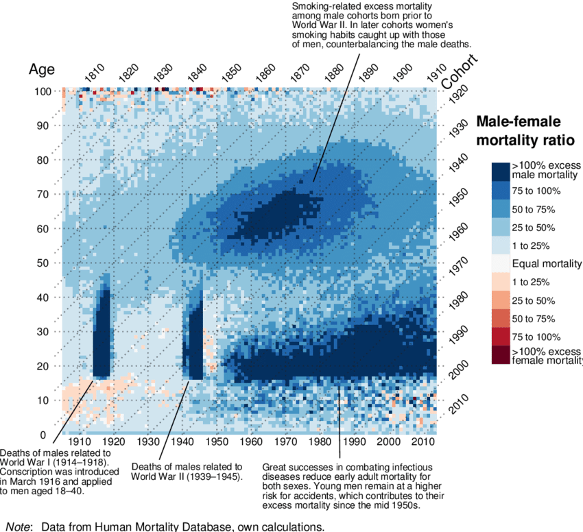

# ggplot (continuación)

```{r include=FALSE}
knitr::opts_chunk$set(echo = TRUE, warning = F)
library(knitr)
library(fontawesome)
library(tidyverse)
Sys.setlocale("LC_ALL", "Spanish_Spain.UTF-8")
eder_personas <- read.csv("data/eder2019_personas.csv")
eder_ned_sexo_long <- eder_personas %>% 
  filter(p2 %in% 1:2, # Elimino los que no tienen asignado el sexo y el nivel educativo
         e_nivel != 9) |> 
  mutate(sexo = case_when(p2 == 1 ~ "Varon", # Recodifico
                          p2 == 2 ~ "Mujer"),
         e_nivel_desc = case_when(e_nivel == 0 ~ "No corresponde/escuelas especiales",
                                  e_nivel == 1 ~ "Inicial",
                                  e_nivel == 2 ~ "Primario incompleto",
                                  e_nivel == 3 ~ "Primario completo",
                                  e_nivel == 4 ~ "Secundario incompleto",
                                  e_nivel == 5 ~ "Secundario completo",
                                  e_nivel == 6 ~ "Superior / Universitario incompleto",
                                  e_nivel == 7 ~ "Superior / Universitario completo y mas",
                                  e_nivel == 8 ~ "Sin instruccion")) |> 
  select(sexo, e_nivel_desc) |> 
  group_by(sexo, e_nivel_desc) |> 
  summarise(n = n()) |> 
  pivot_wider(names_from = sexo, values_from = n)%>% 
  mutate(e_nivel_desc = factor(e_nivel_desc,
                               levels = c("No corresponde/escuelas especiales",
                                          "Inicial",
                                          "Primario incompleto",
                                          "Primario completo",
                                          "Secundario incompleto",
                                          "Secundario completo",
                                          "Superior / Universitario incompleto",
                                          "Superior / Universitario completo y mas",
                                          "Sin instruccion"))) |> 
  arrange(e_nivel_desc) |> 
  pivot_longer(cols = c("Mujer", "Varon"), names_to = "Sexo",values_to ="n")

eder_ned_sexo_long
```

## De barras a pirámides

Si quisiéramos ver el mismo gráfico que antes, pero separado por sexo,
podemos usar las opciones de
[faceting](https://ggplot2.tidyverse.org/reference/facet_grid.html) :

```{r, message=F, warning=FALSE}
g_ned_sexo <- eder_ned_sexo_long %>% 
  ggplot(aes(x = e_nivel_desc, y = n, fill = e_nivel_desc))+
  geom_col()+
  coord_flip() +
  scale_y_continuous(labels = abs) +
  labs(y = "n", 
  x = "Nivel educativo",
  title = "Poblacion por sexo y nivel educativo",
  subtitle = "EDER CABA",
  caption = "Fuente: en base a IDECBA",
  fill = "Nivel educativo") +
  theme_dark() +
  facet_grid(rows = vars(Sexo)) # o cols?
g_ned_sexo
```

¿Podríamos mostrar las distribuciones al interior del total? ¡Claro!

```{r, message=F, warning=FALSE}
g_ned_sexo_stack <- eder_ned_sexo_long %>% 
  ggplot(aes(x = Sexo, y = n, fill = e_nivel_desc))+
  geom_col(stat = "identity")+ # con este parámetro, se apilan
  scale_y_continuous(labels = abs) +
  labs(y = "n", 
  x = "Sexo",
  title = "Poblacion por sexo y nivel educativo",
  subtitle = "EDER CABA",
  caption = "Fuente: en base a IDECBA",
  fill = "") +
  theme_bw()   
g_ned_sexo_stack
```

Quizás si fuera un gráfico interactivo... Un bonus track utilzando
[plotly](https://plot.ly/ggplot2/):

```{r, message=F, warning=FALSE}
#install.packages("plotly")
library(plotly)
g_ned_sexo_plotly <- ggplotly(g_ned_sexo_stack + aes(text = n), tooltip= "text") 
g_ned_sexo_plotly
```

```{r, include=F}
getwd()
library(readxl)
# N_Censo <- read_xlsx("data/pob_censo2010y2022.xlsx", sheet = 1,range = "A1:G23") %>% 
#   pivot_longer(
#     cols = -Edad,
#     names_to = c("Anio", "Sexo"),
#     names_sep = "_",
#     values_to = "Poblacion"
#   ) %>%
#   mutate(
#     Anio = as.integer(Anio)
#   )
# 
# openxlsx::write.xlsx(N_Censo, "data/pob_censo2010y2022.xlsx")

N_Censo <- read_xlsx("data/pob_censo2010y2022.xlsx", sheet = 1)
```

Obtengamos la población censal de los dos últimos censos a nivel
nacional, disponible en el archivo "pob_censo2010y2022.xlsx". Vamos a
armar, paso a paso, la pirámide del censo 2022, empezando por factorizar
la variable `Edad` para que quede ordenada.

```{r}
N_Censo <- N_Censo %>% 
  mutate(Edad = factor(Edad,
                       levels = c("Total",
                                  "0-4",
                                  "5-9",
                                  "10-14",
                                  "15-19",
                                  "20-24",
                                  "25-29",
                                  "30-34",
                                  "35-39",
                                  "40-44",
                                  "45-49",
                                  "50-54",
                                  "55-59",
                                  "60-64",
                                  "65-69",
                                  "70-74",
                                  "75-79",
                                  "80-84",
                                  "85-89",
                                  "90-94",
                                  "95-99",
                                  "100 y más")))
```

Quedémonos con el año 2022 y la distribución por sexo y empecemos a
graficar

```{r}
N_Censo22 <- N_Censo %>% 
  filter(Anio == 2022,
         Edad != "Total",
         Sexo != "Total")

Pir_ER <- ggplot(data = N_Censo22, 
                aes(x = Edad, y = ifelse(Sexo == "Varon", -n, n), 
                    fill = Sexo)) +
                geom_bar(stat = "identity") # que ggplot no trate de contar cual histograma
Pir_ER
```

Hay que dar vuelta (*flip*) la pirámide. ¿Se acuerdan cómo? Podemos
hacerle unos cambios adicionales de paso: fijar los límites horizontales
y mostrar solo absolutos, incluir titulo, subtítulo y fuente, cambiar
las etiquetas de ambos ejes, incluir un *tema* distinto y cambiar el
color de las barras.

```{r, message=F}
Pir_ER <- Pir_ER +
            coord_flip() + # Volteamos la pirámide
            scale_y_continuous(labels = abs  # Que muestre absolutos (sin negativos)
                               ) +
            labs(y = "Población", 
                 x = "Edad",
                 title = "Pirámide de población. Año 2022",
                 subtitle = "Total del país",
                 caption = "Fuente: en base a INDEC") +
            scale_fill_manual(values = c("gold", "blue")) + # Defino los colores del parámetro fill (Sexo)
            theme_bw()
Pir_ER  
```

Probablemente querramos comparar años. Volvamos a utilizar el
`data.frame` de los 2 años.

```{r}

Pirs <- N_Censo %>% 
  filter(Edad != "Total",
         Sexo != "Total") %>% 
                ggplot(aes(x = Edad, y = ifelse(Sexo == "Varon", -n, n), fill = Sexo)) +
                geom_bar(stat = "identity") +
                coord_flip() +
                scale_y_continuous(labels = abs) +
                labs(y = "Población", x = "Edad") +
                labs(title = "Pirámide de población.",
                  subtitle = "Años 2010 y 2022",
                  caption = "Fuente: INDEC") +
                scale_fill_manual(values = c("gold", "blue")) +
                theme_dark() +
                facet_grid(rows = vars(Anio)) # o cols?
Pirs
```

Utilicé dos veces `labs`! Es posible porque `ggplot` funciona sumando
elementos. ¿El gráfico nos permite inferir estadíos transicionales?
Mmm... Deberíamos verlo en porcentajes. Todo en una sentencia:

```{r}
PirsPorc <- N_Censo %>% 
  filter(Edad != "Total",
         Sexo != "Total") %>% 
  group_by(Anio, Sexo) %>% 
  mutate(np = round(n/sum(n)*100,2))%>% 
  ggplot() + 
  aes(x = Edad, y = ifelse(Sexo == "Varon", -np, np), fill = Sexo) +
  geom_bar(stat = "identity") +
  coord_flip() +
  scale_y_continuous(labels = abs) +
  labs(y = "Porcentaje de población", x = "Edad",
       title = "Pirámide de población.",
       subtitle = "Años 2010 y 2022",
       caption = "Fuente: INDEC") +
  theme_bw() +
  scale_fill_manual(values =c("blue", "gold"))+
  facet_grid(cols = vars(Anio))
PirsPorc
```

Podemos aprovechar la diferencia entre `fill` y `color` para poner una
encima de la otra, pero tenemos que transformar los años a columnas

```{r}
N_Censo_p <- N_Censo %>% 
  filter(Edad != "Total",
         Sexo != "Total") %>% 
  group_by(Anio, Sexo) %>% 
  mutate(np = round(n/sum(n)*100,2))%>% 
  select(-n) %>% 
  pivot_wider(names_from = Anio,
              values_from = np)
  
  
 Pir_Sup <- N_Censo_p %>%  
  ggplot() + 
  aes(x = Edad, y = ifelse(Sexo == "Varon", -`2022`, `2022`)) +
  geom_bar(aes(fill = Sexo),
           stat = "identity",
           alpha = .7) +
  geom_bar(aes(y = ifelse(Sexo == "Varon", -`2010`, `2010`),
               color = Sexo),
           stat = "identity",
           linewidth = 1,
           fill = "transparent") +
  coord_flip() +
  scale_y_continuous(labels = abs) +
  labs(y = "Porcentaje de población", x = "Edad",
       title = "Pirámide de población.",
       subtitle = "Años 2010 y 2022",
       caption = "Fuente: INDEC") +
  theme_bw() +
  scale_fill_manual(values =c("blue", "gold"), name = "2022")+
  scale_color_manual(values =c("lightblue", "yellow"), name = "2010")
 
 Pir_Sup
```

¡Ahora sí! Estamos en condiciones de percibir visualmente qué nos dice
el stock por edad y sexo: envejecimiento, efecto migratorio, patrones de
declaración censal de edad. ¿Qué más?

## Lexis

Gráfico útil para representar la dinámica poblacional de *ingreso* y
*permanencia* en un estadío demográfico según edad, tiempo calendario (o
período) y año de nacimiento (o cohorte). Su aplicación más común es en
mortalidad, pero es generalizable a la relación exposición\~evento con
múltiples
[usos](https://apuntesdedemografia.com/curso-de-demografia/temario/tema-2-generalidades/el-diagrama-de-lexis/).\
{width="500px"}

Los elementos principales de análisis son:

-   Líneas de vida (45°)\
-   Segmentos horizontales y verticales\
-   Superficies


Ejemplos de uso del diagrama utilizando R:

-   Mortalidad por conflictos armados (replicable):  Fuente: Alburez et. al (2019)

-   Sobremortalidad masculina en Inglaterra y Gales (1841-2013):
    
    Fuente: Schöley & Willekens (2017)

Construyamos el diagrama básico del inicio. Para eso haremos uso del
paquete [LexisPlotR](https://github.com/ottlngr/LexisPlotR) creado por
Philipp Ottolinger (gracias Otto). Construyó un set de funciones basadas
en *ggplot* que facilita la creación de diagramas haciéndolo un
ejercicio intuitivo.

```{r, message=F, warning=FALSE}
# install.packages("devtools")
# devtools::install_github("ottlngr/LexisPlotR") #¿Cómo no esta en CRAN?
library(LexisPlotR)
library(tidyverse)

# creamos el objeto "mylexis", definiendo el rango de sus ejes: los primeros 10 años de vida durante 2010-2019. Aquí podemos especificar un "delta" si es que nos interesan los grupos quinquenales.
mylexis <- lexis_grid(year_start = 2010, year_end = 2019, age_start = 0, age_end = 10)

# pintamos la edad 2
mylexis <- lexis_age(lg = mylexis, age = 2)

# pintamos el año 2015, de gris en este caso.
mylexis <- lexis_year(lg = mylexis, year = 2015, fill = "grey")

# Ahora la cohorte 2015
mylexis <- lexis_cohort(lg = mylexis, cohort = 2015)

# Una línea de vida, ¡elemento fundamental del diagrama!
mylexis <- lexis_lifeline(lg = mylexis, birth = "2001-09-23", lwd = 1, colour = "pink")

# Al ser un objeto ggplot, podemos incorporarle atributos, como el título
mylexis <- mylexis + labs(x="Año", y = "Edad",title = "Diagrama de Lexis. Elementos de análisis")

# Para crear polígonos, el autor se basa en la geometría "geom_polygon". Creamos un cuadrado. El orden de los datos es importante. Además podemos crear muchos polígonos al mismo tiempo señalando los grupos.
square <- data.frame(group = c(1, 1, 1, 1),
                       x = c("2012-01-01", "2012-01-01", "2013-01-01", "2013-01-01"),
                       y = c(4,             5,            5,            4))
mylexis <- lexis_polygon(lg = mylexis, x = square$x, y = square$y, group = square$group)

# Creamos el triángulo. ¿A qué refiere?
triangle <- data.frame(group = c(1, 1, 1),
                       x = c("2017-01-01", "2018-01-01", "2018-01-01"),
                       y = c(6, 6, 7))
mylexis <- lexis_polygon(lg = mylexis, x = triangle$x, y = triangle$y, group = triangle$group)

# Imprimimos!
mylexis
```

Adicionalmente, si trabajamos con población donde la exposición puede
ser truncada (por derecha o izquierda), podemos graficar líneas de vida
que respeten ese comportamiento. Tambien podemos señalar con una cruz la
ocurrencia del evento de salida que se estudia.

```{r, message=F, warning=FALSE}
# ingresa al estudio sobre deserción escolar en el año 2012 un niño/a nacido en el año 2005, abandonando el colegio a los 9 años de edad:
mylexis <- lexis_lifeline(lg = mylexis, 
                          birth = "2005-09-23", 
                          entry = "2012-06-11", exit = "2015-02-27", lineends = T,
                          colour = "red")
mylexis
```

Pero atrás de esto esta `ggplot`!

```{r, message=F, warning=FALSE}
ggplot() +
  geom_segment(aes(x = 2011, y = 5, xend = 2015, yend = 9), color = "red", size=1)+ # debería ir al final
  geom_point(aes(x=2015, y=9),shape=4,size=2,col=4)+
  coord_equal() +
  scale_x_continuous(breaks=2010:2020, expand = c(0,0)) +
  scale_y_continuous(breaks=0:10, expand = c(0,0)) +
  geom_vline(xintercept = 2010:2020, color="grey", size=.15, alpha = 0.8) +
  geom_hline(yintercept = 0:10, color="grey", size=.15, alpha = 0.8) +
  geom_abline(intercept = seq(-2020, -2000, by=1), slope = 1, color="grey", size=.15, alpha = 0.8)+
  labs(x="Año", y="Edad",title = "Dieagrama de Lexis c/ ggplot")+
  theme_minimal()+
  theme(panel.grid.major = element_line(colour = NA),
        panel.grid.minor = element_line(colour = NA),
        plot.background = element_rect(fill = "white", 
                                       colour = "transparent"))
```

Para incluir triángulos y cuadriláteros se utiliza
[geom_polygon](https://ggplot2.tidyverse.org/reference/geom_polygon.html).
Para dar superficie, de manera similar al gráfico Scholey & Willekens
(2017), se utiliza
[geom_tile](https://ggplot2.tidyverse.org/reference/geom_tile.html).
Para esto último un gran tutorial de [Tim
Riffe](https://timriffe.github.io/DemoTutorials/LexisSurface).

## Estudio de cohorte: un ejemplo

Construyamos una tabla de cohorte a partir de un grupo de estudiantes
que iniciaron con 3 años de edad (cumplida) su trayectoria educativa el
3/3/2000, y donde la *salida* es dejar el estudio (sea cual sea el nivel
alcanzado) por **primera vez** antes de retomar o abandonar
definitivamente (¿en este contexto qué sería $\omega$?). Simulemos el
comportamiento de 1000 chicas/os con distribución *uniforme* de la edad
y distribución *gamma* del tiempo de permanencia:

```{r, message=F, warning=FALSE}
set.seed(100) # qué es esto?
clase <- data.frame(edad_inicio = runif(n = 1000, min = 3, max = 4),
                    tiempo_exp = rgamma(n = 1000, shape = 40, rate = 2)) %>% 
          mutate(edad_salida = edad_inicio + tiempo_exp)
```

¿Cómo luce?

```{r}
ggplot(clase, aes(x=edad_salida)) + 
  geom_histogram(fill=2, alpha=.5) +
  labs(x = "Edad de salida", y = "Densidad", 
       title = "1000 casos simulados de edad de primer salida educativa")
```

Construyamos el diagrama de Lexis de esta cohorte utilizando
`LexisPlotR`:

```{r, message=F, warning=FALSE}
# una forma de moverse en el tiempo: a una fecha restarle cantidad de días
clase$nacimiento  <- as.Date("2000-03-03") - clase$edad_inicio * 365.25
clase$salida      <- clase$nacimiento + clase$tiempo_exp * 365.25

# creo Lexis
mylexis     <- lexis_grid(year_start = 2000, year_end = 2025, age_start = 3, age_end = 30)
mylexis     <- lexis_lifeline(lg = mylexis, 
                          birth = clase$nacimiento, 
                          entry = "2000-03-03", 
                          exit = clase$salida, lineends = T,
                          colour = 4, alpha = 1/3) + 
  theme(axis.text.x = element_text(angle = 90, vjust = 0.5, hjust=1))
mylexis
```

¿Por qué las líneas no empiezan justo en 2000? Estimemos algunos
parámetros básicos:

```{r, results='hold'}
# la edad media de salida
mean(clase$edad_salida)

# la probablidad de "sobrevivir" a la edad 18
clase %>% filter(edad_salida >= 18) %>% summarise(n()/nrow(clase)) 

# probablidad de abandonar en los 20 años cumplidos 
clase %>% filter(edad_salida >= 20 & edad_salida < 21) %>% summarise(n()/nrow(clase))
```

### Actividad

a)  Crear un diagrama de Lexis e incluir en rojo las líneas de vida de
    las 3 personas más jóvenes que conozcas.

```{r, eval = F, include = F}
mylexis <- lexis_grid(year_start = 2021, year_end = 2023, age_start = 0, age_end = 5)
lexis_lifeline(lg = mylexis, birth = c("2021-10-23", "2022-01-15", "2022-09-19"), lwd = 1, colour = "red")
```

a)  Considerando el ejercicio de permanencia escolar:

    -   Calcula la probabilidad de "salir" luego de los 30 años?

    ```{r, eval = F, include = F}
    clase %>% filter(edad_salida >= 30) %>% summarise(n()/nrow(clase))
    ```

    -   Cambia la semilla del ejercicio previo (`set.seed()`) por
        cualquier entero que desees y repite el ejercicio. ¿Hay
        diferencias? ¿Por qué?

## Mapas temáticos

Antes que nada, necesitamos descargar datos geográficos. Como fuente se
puede recurrir al [Instituto Geográfico Nacional
(IGN)](https://www.ign.gob.ar/NuestrasActividades/InformacionGeoespacial/CapasSIG)
y al [INDEC](https://www.indec.gob.ar/indec/web/Nivel3-Tema-1-17), desde
donde se pueden descargar distinta info oficial y que están consistidas
entre sí. También necesitamos un paquete que pueda "manejar" este tipo
de datos: [`sf`](https://r-spatial.github.io/sf/) y su función para
leer: `read_sf()`, capaz de leer varios formatos de datos geográficos
(GeoJSON, shape, etc.).

```{r, message=FALSE, warning=FALSE}
# install.packages("sf")
library(sf)

prov_geoj<-st_read("https://wms.ign.gob.ar/geoserver/ign/ows?service=WFS&version=1.0.0&request=GetFeature&typeName=ign%3Aprovincia&outputFormat=application%2Fjson") # Se puede descargar directamente con el link

ruta_completa <- normalizePath("data/capa_jurisdicciones.zip")
prov_shp <- st_read(paste0("/vsizip/", ruta_completa, "/jurisdicciones.shp")) #O se puede descargar y leer con st_read()

str(prov_shp)
summary(prov_shp)

prov_shp %>%
  ggplot()+
  geom_sf()+
  coord_sf()
prov_geoj %>%
  ggplot()+
  geom_sf()+
  coord_sf()

```

Podemos modificar cuánto vemos del mapa (los límites) para ajustarlo a
nuestras necesidades. Por ejemplo, si quisiéramos centrarnos en las
provincias y dejar de lado la Antártida. ¿Y agregar los nombres de las
provincias, quizás?

```{r, warning=FALSE, message=FALSE}
prov_shp %>%
  ggplot()+
  geom_sf()+
  geom_sf_text(aes(label = nam),
               size = 2) +
  coord_sf(xlim = c(-75, -52),   # longitud
           ylim = c(-22, -55)) + # latitud
  theme_bw()
```

¿Y cómo hacemos para darle vida a este mapa? Primero, necesitamos datos
por provincia. Vamos a usar los datos de porcentaje de hogares
particulares sin acceso a la red de servicio cloacal, del censo 2022,
presentes en el archivo `hog_cloaca2022.xlsx`. Miremos un poco el
archivo

```{r}
library(openxlsx)
hog_cloaca22 <- read.xlsx("data/hog_cloaca2022.xlsx")
head(hog_cloaca22)
class(hog_cloaca22)
summary(hog_cloaca22)
```

¿Qué cosas tenemos en común entre este data frame y el de datos
geográficos? Dos cosas: el nombre de la provincia y su código (pueden
ver los oficiales
[acá](https://www.indec.gob.ar/ftp/cuadros/geoestadistica/c2022_codigos_jurisdicciones.xlsx)).
Los códigos son muy útiles porque muchas instituciones los utilizan, y
es más probable que tengan menos diferencias que el nombre (mayúsculas,
"CABA" en vez de "Ciudad Autónoma de Buenos Aires", etc). Entonces,
vamos a unirlo por código con `left_join()` aunque tengan nombre
distinto las variables:

```{r}
hog_cloaca_geo <- prov_shp %>% 
  left_join(hog_cloaca22,
            by = c("cpr" = "cod"))
head(hog_cloaca_geo) 
```

Ahora, ¿cómo poner en color las provincias según el indicador? Primero,
quedémonos con las variables que nos interesan y luego grafiquemos:
acordémonos de `aes()`

```{r}
hog_cloaca_geo <- hog_cloaca_geo %>% 
  select(nam, # Nombre 
         Año, # Año (aunque solo tenemos 2022)
         Total, # Valor del indicador
         geometry) # geometría

p_cloaca <- ggplot(hog_cloaca_geo)+
  geom_sf(aes(fill = Total),
          color = "grey90")+
  coord_sf(xlim = c(-75, -52),   # longitud
           ylim = c(-22, -55))+
  theme_bw()
p_cloaca
```

Pero la paleta de colores está rara. Vamos a ponerle otra y cambiar la
dirección, para que más oscuro = más alto porcentaje de hogares sin
cloaca. Y, de paso, agreguemos título y demás:

```{r}
p_cloaca +
  scale_fill_distiller("%",palette = "Reds",direction = 1)+
  labs(title = "Porcentaje de hogares particulares \nsin acceso a la red de servicio cloacal",
       subtitle = "Por provincia. Año 2022",
       caption = "Fuente: INDEC") 
```

### Actividad

Mapear un indicador a elección, puede ser a nivel de departamentos o de
provincias, realizando la unión de data frames de la geometría y el
indicador, e incluir título, subtítulo y fuente. Fuentes posibles de
indicadores (no limitado):

1.  INDEC:

-   [Cuadros de
    censos](https://www.indec.gob.ar/indec/web/Nivel3-Tema-2-41)

-   [Redatam](https://redatam.indec.gob.ar/)

-   [Indicadores
    demográficos](https://www.indec.gob.ar/indec/web/Institucional-Indec-IndicadoresDemograficos)

-   [Sistema Integrado de Estadísticas Sociales
    (SIES)](https://shiny.indec.gob.ar/sies/)

-   y muchos otros más

2.  Salud - [Reporte interactivo de Estadísticas
    Vitales](https://www.argentina.gob.ar/salud/deis/reporte-interactivo)

3.  [PBA - Portal de datos abiertos](https://catalogo.datos.gba.gob.ar/)

4.  [CABA - Portal de datos
    abiertos](https://buenosaires.gob.ar/bienvenidos-al-portal-de-datos-abiertos-de-la-ciudad)

Y las fuentes de geometrías:

-   [IGN](https://www.ign.gob.ar/NuestrasActividades/InformacionGeoespacial/CapasSIG)

-   [INDEC](https://www.indec.gob.ar/indec/web/Nivel3-Tema-1-17)

-   [CABA - Comunas](https://data.buenosaires.gob.ar/dataset/comunas)
    (descargar .zip con el shapefile o GeoJSON)

-   [PBA - Partidos](https://catalogo.datos.gba.gob.ar/dataset/partidos)

<!-- ## Reproduciendo -->

<!-- El covid19 puso en primera plana el análisis demográfico, especialmente en el impacto que tuvo en $e_0$ ¿No te parece genial la figura 1 del paper [Quantifying impacts of the COVID-19 pandemic through life-expectancy losses: a population-level study of 29 countries](https://academic.oup.com/ije/advance-article/doi/10.1093/ije/dyab207/6375510) de Aburto y Otros (2021)? Podemos recrearlo gracias a que los autores lo permiten [aquí](https://github.com/OxfordDemSci/ex2020/blob/master/src/08-plots.R), haciendo su paper reproducible. De paso vamos viendo funciones nuevas. Iremos comentando los pasos: -->

<!-- ```{r} -->

<!-- # necesitamos algunas librerías que no tenemos aún. Si no las tenés debes instalarlas primero -->

<!-- #install.packages("hrbrthemes") -->

<!-- library(hrbrthemes) -->

<!-- # cargar la data -->

<!-- df_ex_ci <- readRDS("Data/df_ex_ci.rds") -->

<!-- head(df_ex_ci) -->

<!-- # crear el gráfico -->

<!-- fig_1 <- df_ex_ci %>% -->

<!--   # primero factorizar según el número actual de la variable -->

<!--   mutate(name = name %>% fct_reorder(rank_e0f19)) %>% -->

<!--   # me interesa ciertas edades -->

<!--   filter(age %in% c(0, 60)) %>% -->

<!--   # si hay alguna NA sacar la fila -->

<!--   drop_na(name) %>% -->

<!--   # una forma de seleccionar -->

<!--   transmute(name, sex, age,ex_2015, ex_2019, ex_2020 = ex) %>% -->

<!--   # hete aquí un pivot... -->

<!--   pivot_longer(cols = ex_2015:ex_2020, -->

<!--                names_to = "year", values_to = "ex", names_prefix = "ex_") %>% -->

<!--   mutate(age = age %>% as_factor()) %>%  -->

<!--   # ggplot -->

<!--   ggplot()+ -->

<!--   # un color por sexo, una forma por año -->

<!--   geom_point(aes(x = ex, y = name, color = sex, shape = year))+ -->

<!--   # separar un poco con líneas grises -->

<!--   geom_hline(yintercept = seq(2, 28, 2), size = 5, color = "#eaeaea")+ -->

<!--   # personalizar qué formas, tamaños y colores usar -->

<!--   scale_shape_manual(values = c(124, 43, 16))+ -->

<!--   scale_size_manual(values = c(4, 4, 1.5))+ -->

<!--   scale_color_manual(values = c("#B5223BFF", "#64B6EEFF"))+ -->

<!--   # donde colocar los nombres de los ejes -->

<!--   scale_y_discrete(position = "right")+ -->

<!--   scale_x_continuous(position = "top")+ -->

<!--   # facet por edad, sin respetar escala -->

<!--   facet_grid(~age, scales = "free_x")+ -->

<!--   # sin leyenda, líneas horizonatales y demases -->

<!--   theme( -->

<!--     legend.position = "none", -->

<!--     panel.grid.major.y = element_blank(), -->

<!--     panel.grid.minor.y = element_blank(), -->

<!--     strip.text = element_blank(), -->

<!--     panel.spacing.x = unit(2, "lines"), -->

<!--     axis.text.y = element_text(face = 2))+ -->

<!--   # etiquetas de ejes -->

<!--   labs(x = "Life expectancy, years",y = NULL) -->

<!-- # guardar -->

<!-- ggsave(fig_1, filename = "fig-1.pdf", -->

<!--        width = 6, height = 4.5, device = cairo_pdf) -->

<!-- ``` -->

<!-- Las etiquetas en referencia a la edad y la formas de los puntos las realizaron posteriormente con [annotate](https://ggplot2.tidyverse.org/reference/annotate.html), una función que permite incluir (encima) texto u otras figuras geométricas en el plano. -->

<!-- ## Otras visualizaciones -->

<!-- Samuel Preston (1975) encontró una relación matemática (al menos) a nivel de país entre la esperanza de vida al nacer y el producto per cápita. Veamos que ocurre específicamente en el Continente Americano utilizando el paquete de datos `gapminder`. -->

<!-- ```{r} -->

<!-- library(gapminder) -->

<!-- p <- ggplot(filter(gapminder, continent == "Americas"), -->

<!--             aes(x = gdpPercap, y = lifeExp)) -->

<!-- p + geom_point() # dispersión -->

<!-- p + geom_point(aes(color = country), alpha = (1/3), size = 3, show.legend = F)  -->

<!-- p1 <- p + geom_point(aes(color = country, size = pop), alpha = 1/3) # fijate el lugar de size  -->

<!-- p1 <- p1 + geom_smooth(lwd = 1, lty = 2, color = 2, se = FALSE) -->

<!-- p1 -->

<!-- p + geom_point(alpha = 1/3, size = 3) + facet_wrap(~ country) + -->

<!--     geom_smooth(lwd = 1.5, se = FALSE) + -->

<!--     theme_void() -->

<!-- ``` -->

<!-- ¿Componer gráficos en una sola hoja? (tomado de [Jenny Bryan](https://stat545.com/)) -->

<!-- ```{r} -->

<!-- #install.packages("gridExtra") -->

<!-- library(gridExtra) -->

<!-- p2 <- ggplot(filter(gapminder, year==1952 & continent!="Oceania"), aes(x = lifeExp, color = continent))       + geom_density() -->

<!-- p3 <- ggplot(filter(gapminder, year==2007 & continent!="Oceania"), aes(x = lifeExp, color = continent))       + geom_density() -->

<!-- grid.arrange(p2, p3, nrow = 2, heights = c(0.5, 0.5)) -->

<!-- ``` -->

<!-- ¿Qué problemas encuentras en este arreglo? -->

<!-- ## Material adicional (y no tanto) -->

<!-- * Sí, hay un [libro](https://ggplot2-book.org/index.html). -->

<!-- * Estas notas fueron hechas siguiendo principalmente [The Hitchhiker's Guide to Ggplot2](https://leanpub.com/hitchhikers_ggplot2) y el curso de [Jenny Bryan](https://stat545.com/).   -->

<!-- * [Hoja de Ayuda](https://github.com/rstudio/cheatsheets/blob/main/data-visualization-2.1.pdf).   -->

<!-- * Hulíková Tesárková & Kurtinová. Application of “Lexis” Diagram: Contemporary Approach to Demographic Visualization and Selected Examples of Software Applications. -->

<!-- * Rau, R., Bohk-Ewald, C., Muszyńska, M. M., & Vaupel, J. W. (2018). Visualizing Mortality Dynamics in the Lexis Diagram. Springer. doi: 10.1007/978-3-319-64820-0 -->
