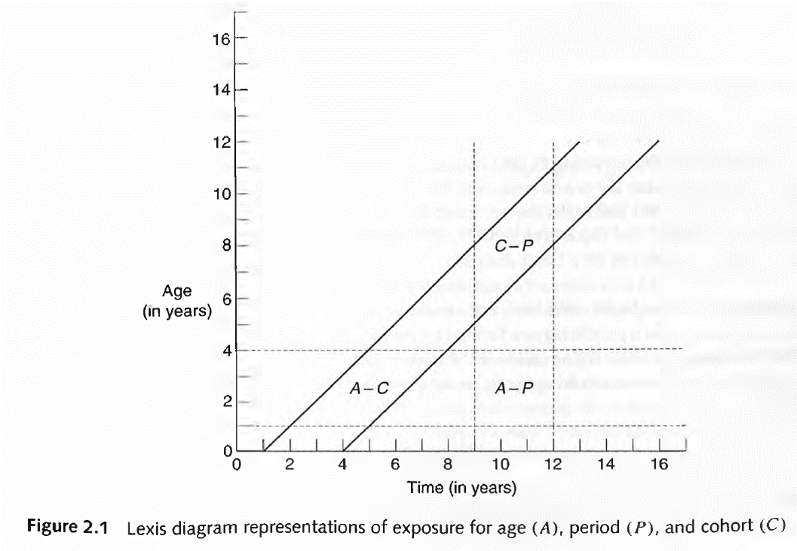
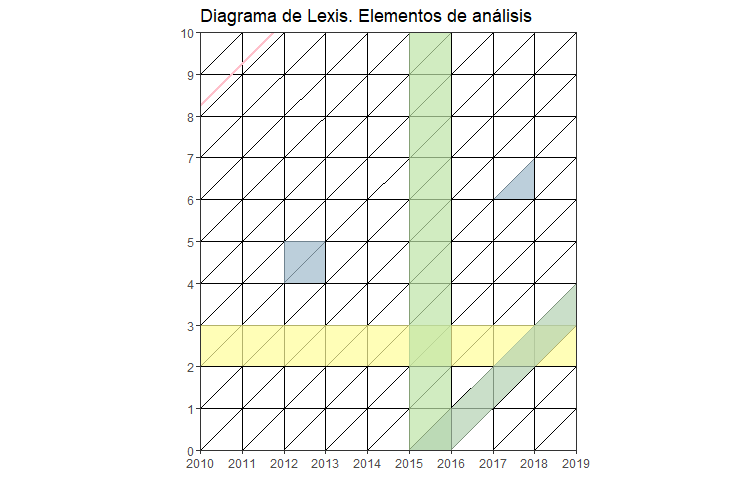

# ggplot (continuación)

```{r include=FALSE}
knitr::opts_chunk$set(echo = TRUE, warning = F)
library(knitr)
library(fontawesome)
library(tidyverse)
Sys.setlocale("LC_ALL", "Spanish_Spain.UTF-8")
eder_personas <- read.csv("data/eder2019_personas.csv")
eder_ned_sexo_long <- eder_personas %>% 
  filter(p2 %in% 1:2, # Elimino los que no tienen asignado el sexo y el nivel educativo
         e_nivel != 9) |> 
  mutate(sexo = case_when(p2 == 1 ~ "Varon", # Recodifico
                          p2 == 2 ~ "Mujer"),
         e_nivel_desc = case_when(e_nivel == 0 ~ "No corresponde/escuelas especiales",
                                  e_nivel == 1 ~ "Inicial",
                                  e_nivel == 2 ~ "Primario incompleto",
                                  e_nivel == 3 ~ "Primario completo",
                                  e_nivel == 4 ~ "Secundario incompleto",
                                  e_nivel == 5 ~ "Secundario completo",
                                  e_nivel == 6 ~ "Superior / Universitario incompleto",
                                  e_nivel == 7 ~ "Superior / Universitario completo y mas",
                                  e_nivel == 8 ~ "Sin instruccion")) |> 
  select(sexo, e_nivel_desc) |> 
  group_by(sexo, e_nivel_desc) |> 
  summarise(n = n()) |> 
  pivot_wider(names_from = sexo, values_from = n)%>% 
  mutate(e_nivel_desc = factor(e_nivel_desc,
                               levels = c("No corresponde/escuelas especiales",
                                          "Inicial",
                                          "Primario incompleto",
                                          "Primario completo",
                                          "Secundario incompleto",
                                          "Secundario completo",
                                          "Superior / Universitario incompleto",
                                          "Superior / Universitario completo y mas",
                                          "Sin instruccion"))) |> 
  arrange(e_nivel_desc) |> 
  pivot_longer(cols = c("Mujer", "Varon"), names_to = "Sexo",values_to ="n")

eder_ned_sexo_long
```

## De barras a pirámides

Si quisiéramos ver el mismo gráfico que antes, pero separado por sexo,
podemos usar las opciones de
[faceting](https://ggplot2.tidyverse.org/reference/facet_grid.html) :

```{r nivel ed facet, message=F, warning=FALSE}
g_ned_sexo <- eder_ned_sexo_long %>% 
  ggplot(aes(x = e_nivel_desc, y = n, fill = e_nivel_desc))+
  geom_col()+
  coord_flip() +
  scale_y_continuous(labels = abs) +
  labs(y = "n", 
  x = "Nivel educativo",
  title = "Poblacion por sexo y nivel educativo",
  subtitle = "EDER CABA",
  caption = "Fuente: en base a IDECBA",
  fill = "Nivel educativo") +
  theme_dark() +
  facet_grid(rows = vars(Sexo)) # o cols?
g_ned_sexo
```

¿Podríamos mostrar las distribuciones al interior del total? ¡Claro!

```{r nivel ed facet2, message=F, warning=FALSE}
g_ned_sexo_stack <- eder_ned_sexo_long %>% 
  ggplot(aes(x = Sexo, y = n, fill = e_nivel_desc))+
  geom_col(stat = "identity")+ # con este parámetro, se apilan
  scale_y_continuous(labels = abs) +
  labs(y = "n", 
  x = "Sexo",
  title = "Poblacion por sexo y nivel educativo",
  subtitle = "EDER CABA",
  caption = "Fuente: en base a IDECBA",
  fill = "") +
  theme_bw()   
g_ned_sexo_stack
```

Quizás si fuera un gráfico interactivo... Un bonus track utilzando
[plotly](https://plot.ly/ggplot2/):

```{r nivel ed interact, message=F, warning=FALSE}
#install.packages("plotly")
library(plotly)
g_ned_sexo_plotly <- ggplotly(g_ned_sexo_stack + aes(text = n), tooltip= "text") 
g_ned_sexo_plotly
```

```{r, include=F}
getwd()
library(readxl)
# N_Censo <- read_xlsx("data/pob_censo2010y2022.xlsx", sheet = 1,range = "A1:G23") %>% 
#   pivot_longer(
#     cols = -Edad,
#     names_to = c("Anio", "Sexo"),
#     names_sep = "_",
#     values_to = "Poblacion"
#   ) %>%
#   mutate(
#     Anio = as.integer(Anio)
#   )
# 
# openxlsx::write.xlsx(N_Censo, "data/pob_censo2010y2022.xlsx")

N_Censo <- read_xlsx("data/pob_censo2010y2022.xlsx", sheet = 1)
```

Obtengamos la población censal de los dos últimos censos a nivel
nacional, disponible en el archivo "pob_censo2010y2022.xlsx". Vamos a
armar, paso a paso, la pirámide del censo 2022, empezando por factorizar
la variable `Edad` para que quede ordenada.

```{r}
N_Censo <- N_Censo %>% 
  mutate(Edad = factor(Edad,
                       levels = c("Total",
                                  "0-4",
                                  "5-9",
                                  "10-14",
                                  "15-19",
                                  "20-24",
                                  "25-29",
                                  "30-34",
                                  "35-39",
                                  "40-44",
                                  "45-49",
                                  "50-54",
                                  "55-59",
                                  "60-64",
                                  "65-69",
                                  "70-74",
                                  "75-79",
                                  "80-84",
                                  "85-89",
                                  "90-94",
                                  "95-99",
                                  "100 y más")))
```

Quedémonos con el año 2022 y la distribución por sexo y empecemos a
graficar

```{r pir1}
N_Censo22 <- N_Censo %>% 
  filter(Anio == 2022,
         Edad != "Total",
         Sexo != "Total")

Pir_ER <- ggplot(data = N_Censo22, 
                aes(x = Edad, y = ifelse(Sexo == "Varon", -n, n), 
                    fill = Sexo)) +
                geom_bar(stat = "identity") # que ggplot no trate de contar cual histograma
Pir_ER
```

Hay que dar vuelta (*flip*) la pirámide. ¿Se acuerdan cómo? Podemos
hacerle unos cambios adicionales de paso: fijar los límites horizontales
y mostrar solo absolutos, incluir titulo, subtítulo y fuente, cambiar
las etiquetas de ambos ejes, incluir un *tema* distinto y cambiar el
color de las barras.

```{r pir2, message=F}
Pir_ER <- Pir_ER +
            coord_flip() + # Volteamos la pirámide
            scale_y_continuous(labels = abs  # Que muestre absolutos (sin negativos)
                               ) +
            labs(y = "Población", 
                 x = "Edad",
                 title = "Pirámide de población. Año 2022",
                 subtitle = "Total del país",
                 caption = "Fuente: en base a INDEC") +
            scale_fill_manual(values = c("aquamarine4", "purple")) + # Defino los colores del parámetro fill (Sexo)
            theme_bw()
Pir_ER  
```

Probablemente querramos comparar años. Volvamos a utilizar el
`data.frame` de los 2 años.

```{r pir3}

Pirs <- N_Censo %>% 
  filter(Edad != "Total",
         Sexo != "Total") %>% 
                ggplot(aes(x = Edad, y = ifelse(Sexo == "Varon", -n, n), fill = Sexo)) +
                geom_bar(stat = "identity") +
                coord_flip() +
                scale_y_continuous(labels = abs) +
                labs(y = "Población", x = "Edad") +
                labs(title = "Pirámide de población.",
                  subtitle = "Años 2010 y 2022",
                  caption = "Fuente: INDEC") +
                scale_fill_manual(values = c("aquamarine4", "purple")) +
                theme_grey() +
                facet_grid(rows = vars(Anio)) # o cols?
Pirs
```

Utilicé dos veces `labs`! Es posible porque `ggplot` funciona sumando
elementos. ¿El gráfico nos permite inferir estadíos transicionales?
Mmm... Deberíamos verlo en porcentajes. Todo en una sentencia:

```{r pir4}
PirsPorc <- N_Censo %>% 
  filter(Edad != "Total",
         Sexo != "Total") %>% 
  group_by(Anio, Sexo) %>% 
  mutate(np = round(n/sum(n)*100,2))%>% 
  ggplot() + 
  aes(x = Edad, y = ifelse(Sexo == "Varon", -np, np), fill = Sexo) +
  geom_bar(stat = "identity") +
  coord_flip() +
  scale_y_continuous(labels = abs) +
  labs(y = "Porcentaje de población", x = "Edad",
       title = "Pirámide de población.",
       subtitle = "Años 2010 y 2022",
       caption = "Fuente: INDEC") +
  theme_bw() +
  scale_fill_manual(values =c("aquamarine4", "purple"))+
  facet_grid(cols = vars(Anio))
PirsPorc
```

Podemos aprovechar la diferencia entre `fill` y `color` para poner una
encima de la otra, pero tenemos que transformar los años a columnas

```{r pir5}
N_Censo_p <- N_Censo %>% 
  filter(Edad != "Total",
         Sexo != "Total") %>% 
  group_by(Anio, Sexo) %>% 
  mutate(np = round(n/sum(n)*100,2))%>% 
  select(-n) %>% 
  pivot_wider(names_from = Anio,
              values_from = np)
  
  
 Pir_Sup <- N_Censo_p %>%  
  ggplot() + 
  aes(x = Edad, y = ifelse(Sexo == "Varon", -`2022`, `2022`)) +
  geom_bar(aes(fill = Sexo),
           stat = "identity",
           alpha = .7) +
  geom_bar(aes(y = ifelse(Sexo == "Varon", -`2010`, `2010`),
               color = Sexo),
           stat = "identity",
           linewidth = 1,
           fill = "transparent") +
  coord_flip() +
  scale_y_continuous(labels = abs) +
  labs(y = "Porcentaje de población", x = "Edad",
       title = "Pirámide de población.",
       subtitle = "Años 2010 y 2022",
       caption = "Fuente: INDEC") +
  theme_bw() +
  scale_fill_manual(values =c("aquamarine4", "purple"), name = "2022")+
  scale_color_manual(values =c("aquamarine", "magenta"), name = "2010")
 
 Pir_Sup
```

¡Ahora sí! Estamos en condiciones de percibir visualmente qué nos dice
el stock por edad y sexo: envejecimiento, efecto migratorio, patrones de
declaración censal de edad. ¿Qué más?

## Lexis

Gráfico útil para representar la dinámica poblacional de *ingreso* y
*permanencia* en un estadío demográfico según edad, tiempo calendario (o
período) y año de nacimiento (o cohorte). Su aplicación más común es en
mortalidad, pero es generalizable a la relación exposición\~evento con
múltiples
[usos](https://apuntesdedemografia.com/curso-de-demografia/temario/tema-2-generalidades/el-diagrama-de-lexis/).\
{width="500px"}

Los elementos principales de análisis son:

-   Líneas de vida (45°)\
-   Segmentos horizontales y verticales\
-   Superficies



Ejemplo de uso del diagrama utilizando R:

-   Mortalidad por conflictos armados (replicable):  Fuente: Alburez et. al (2019)

Construyamos el diagrama básico del inicio. Para eso haremos uso del
paquete [LexisPlotR](https://github.com/ottlngr/LexisPlotR) creado por
Philipp Ottolinger (gracias Otto). Construyó un set de funciones basadas
en *ggplot* que facilita la creación de diagramas haciéndolo un
ejercicio intuitivo.

```{r lexis1}

# Si el paquete no está disponible en CRAN, podemos instalarlo desde GitHub
# install.packages("devtools")
# devtools::install_github("ottlngr/LexisPlotR")

library(LexisPlotR)  # Paquete específico para construir diagramas de Lexis
library(tidyverse)   # Para manipular datos y utilizar funciones de ggplot2


# 1. Creamos el objeto "mylexis", que define el marco temporal del diagrama.

# En este caso: años calendario 2010-2019 y edades 0-10 años.
# Podríamos especificar un “delta” si quisiéramos mostrar grupos quinquenales, por ejemplo.
mylexis <- lexis_grid(year_start = 2010, year_end = 2019, 
                      age_start = 0, age_end = 10)


# 2. Elementos básicos

# Resaltamos una edad específica: 2 años
mylexis <- lexis_age(lg = mylexis, age = 2)

# Resaltamos un año calendario: 2015
mylexis <- lexis_year(lg = mylexis, year = 2015, fill = "grey")

# Resaltamos la cohorte de 2015 (línea diagonal)
mylexis <- lexis_cohort(lg = mylexis, cohort = 2015)

# Una línea de vida, ¡elemento fundamental del diagrama!
#Representa cómo aumenta la edad con el paso de los años calendario
mylexis <- lexis_lifeline(lg = mylexis, birth = "2001-09-23", 
                          lwd = 1, colour = "pink")


# Al ser un objeto ggplot, podemos incorporarle atributos, como el título o etiquetas
mylexis <- mylexis + labs(x = "Año", 
                          y = "Edad", 
                          title = "Diagrama de Lexis. Elementos de análisis")


# 3. Polígonos: cuadrado y triángulo

# Para crear polígonos, el autor se basa en la geometría "geom_polygon". Creamos un cuadrado. 
#El orden de los datos es importante. Además podemos crear muchos polígonos al mismo tiempo señalando los grupos.
# Ejemplo: creamos un cuadrado que abarca entre los años 2012 y 2013, y edades 4 a 5.
square <- data.frame(
  group = c(1, 1, 1, 1),
  x = c("2012-01-01", "2012-01-01", "2013-01-01", "2013-01-01"),
  y = c(4, 5, 5, 4)
)

# Lo agregamos al diagrama
mylexis <- lexis_polygon(lg = mylexis, 
                         x = square$x, y = square$y, 
                         group = square$group)


# Creamos el triángulo. ¿A qué refiere?
triangle <- data.frame(
  group = c(1, 1, 1),
  x = c("2017-01-01", "2018-01-01", "2018-01-01"),
  y = c(6, 6, 7)
)

mylexis <- lexis_polygon(lg = mylexis, 
                         x = triangle$x, y = triangle$y, 
                         group = triangle$group)

# Imprimimos!
mylexis

```

Adicionalmente, si trabajamos con población donde la exposición puede
ser truncada (por derecha o izquierda), podemos graficar líneas de vida
que respeten ese comportamiento. También podemos señalar con una cruz la
ocurrencia del evento de salida que se estudia.

```{r lexis2, message=F, warning=FALSE}

# Ejemplo: trayectoria educativa en el diagrama de Lexis

# ingresa al estudio sobre deserción escolar en el año 2012 un niño/a nacido en el año 2005, #abandonando el colegio a los 9 años de edad:

mylexis <- lexis_lifeline(lg = mylexis, 
                          birth = "2005-09-23",   # fecha de nacimiento
                          entry = "2012-06-11",   # fecha en que entra al estudio (inicio del seguimiento)
                          exit  = "2015-02-27",   # fecha en que deja de ser observado (abandono)
                          lineends = TRUE,        # agrega marcas visibles en los extremos de la línea
                          colour = "red")         # color de la línea

mylexis
```

Para incluir triángulos y cuadriláteros se utiliza
[geom_polygon](https://ggplot2.tidyverse.org/reference/geom_polygon.html).
Para dar superficie se utiliza
[geom_tile](https://ggplot2.tidyverse.org/reference/geom_tile.html).
Para esto último un gran tutorial de [Tim
Riffe](https://timriffe.github.io/DemoTutorials/LexisSurface).

### Actividad

a)  Crear un diagrama de Lexis e incluir en distintos colores líneas de
    vida de las 3 personas más jóvenes que conozcas.

```{r lexis3, eval = F, include = F}
lexis_act <- lexis_grid(year_start=2021, year_end=2024,
                         age_start=0, age_end=5)
lexis_act<-lexis_lifeline(lg = lexis_act,
               birth = c("2021-02-15","2022-08-10","2023-03-05"),
               lwd=1,
               colour = c("red","green","blue"))
lexis_act

```

b)  Agregar 2 líneas de vida truncadas: simular la trayectoria de 2
    personas que ingresan y salen de un estudio en distintos momentos.

    ```{r lexis4, eval = F, include = F}
    lexis_act<-lexis_lifeline(lg = lexis_act,
               birth = c("2021-06-01","2022-03-15"),
               entry = c("2022-01-01","2023-01-01"),
               exit  = c("2023-06-01","2023-12-01"),
               lineends = TRUE,
               colour = c("orange","purple"))

    lexis_act
    ```

c)  Resaltar un año y una cohorte (usando lexis_year y lexis_cohort)

    ```{r lexis5, eval = F, include = F}
    lexis_act <- lexis_year(lexis_act, year = 2022, fill = "lightgrey")
    lexis_act <- lexis_cohort(lexis_act, cohort = 2023, fill = "orange")
    lexis_act
    ```

### BONUS

Detrás de Lexis está `ggplot`!

```{r lexis6, message=F, warning=FALSE}
ggplot() +
  geom_segment(aes(x = 2011, y = 5, xend = 2015, yend = 9), color = "red", size=1)+ 
  geom_point(aes(x=2015, y=9),shape=4,size=2,col=4)+ # Agrega un punto al final del segmento (año 2015, edad 9)
  coord_equal() +   # Mantiene la misma escala en ambos ejes (aspecto cuadrado)
  scale_x_continuous(breaks=2010:2020, expand = c(0,0)) +
  scale_y_continuous(breaks=0:10, expand = c(0,0)) +
  geom_vline(xintercept = 2010:2020, color="grey", size=.15, alpha = 0.8) +
  geom_hline(yintercept = 0:10, color="grey", size=.15, alpha = 0.8) +
  geom_abline(intercept = seq(-2020, -2000, by=1), slope = 1, color="grey", size=.15, alpha = 0.8)+
  labs(x="Año", y="Edad",title = "Dieagrama de Lexis c/ ggplot")+
  theme_minimal()+
  # Elimina cuadrículas del panel y define fondo blanco
  theme(panel.grid.major = element_line(colour = NA),
        panel.grid.minor = element_line(colour = NA),
        plot.background = element_rect(fill = "white", 
                                       colour = "transparent"))

```

## Mapas temáticos

Antes que nada, necesitamos descargar datos geográficos. Como fuente se
puede recurrir al [Instituto Geográfico Nacional
(IGN)](https://www.ign.gob.ar/NuestrasActividades/InformacionGeoespacial/CapasSIG)
y al [INDEC](https://www.indec.gob.ar/indec/web/Nivel3-Tema-1-17), desde
donde se pueden descargar distinta info oficial y que están consistidas
entre sí. También necesitamos un paquete que pueda "manejar" este tipo
de datos: [`sf`](https://r-spatial.github.io/sf/) y su función para
leer: `read_sf()`, capaz de leer varios formatos de datos geográficos
(GeoJSON, shape, etc.).

```{r map1, message=FALSE, warning=FALSE}
# install.packages("sf")
library(sf)

ruta_completa <- normalizePath("data/capa_jurisdicciones.zip")
prov_shp <- st_read(paste0("/vsizip/", ruta_completa, "/jurisdicciones.shp"), quiet=T) #O se puede descargar y leer con st_read()

str(prov_shp)
summary(prov_shp)

prov_shp %>%
  ggplot()+
  geom_sf()+
  coord_sf()

```

Podemos modificar cuánto vemos del mapa (los límites) para ajustarlo a
nuestras necesidades. Por ejemplo, si quisiéramos centrarnos en las
provincias y dejar de lado la Antártida. ¿Y agregar los nombres de las
provincias, quizás?

```{r map2, warning=FALSE, message=FALSE}
prov_shp %>%
  ggplot()+
  geom_sf()+
  geom_sf_text(aes(label = nam),
               size = 2) +
  coord_sf(xlim = c(-75, -52),   # longitud
           ylim = c(-22, -55)) + # latitud
  theme_bw()
```

¿Y cómo hacemos para darle vida a este mapa? Primero, necesitamos datos
por provincia. Vamos a usar los datos de porcentaje de hogares
particulares sin acceso a la red de servicio cloacal, del censo 2022,
presentes en el archivo `hog_cloaca2022.xlsx`. Miremos un poco el
archivo

```{r map3}
library(openxlsx)
hog_cloaca22 <- read.xlsx("data/hog_cloaca2022.xlsx")
head(hog_cloaca22)
class(hog_cloaca22)
summary(hog_cloaca22)
```

¿Qué cosas tenemos en común entre este data frame y el de datos
geográficos? Dos cosas: el nombre de la provincia y su código (pueden
ver los oficiales
[acá](https://www.indec.gob.ar/ftp/cuadros/geoestadistica/c2022_codigos_jurisdicciones.xlsx)).
Los códigos son muy útiles porque muchas instituciones los utilizan, y
es más probable que tengan menos diferencias que el nombre (mayúsculas,
"CABA" en vez de "Ciudad Autónoma de Buenos Aires", etc). Entonces,
vamos a unirlo por código con `left_join()` aunque tengan nombre
distinto las variables:

```{r map4, warning=FALSE, message=FALSE}
hog_cloaca_geo <- prov_shp %>% 
  left_join(hog_cloaca22,
            by = c("cpr" = "cod"))
head(hog_cloaca_geo) 
```

Ahora, ¿cómo poner en color las provincias según el indicador? Primero,
quedémonos con las variables que nos interesan y luego grafiquemos:
acordémonos de `aes()`

```{r map5}
hog_cloaca_geo <- hog_cloaca_geo %>% 
  select(nam, # Nombre 
         Año, # Año (aunque solo tenemos 2022)
         Total, # Valor del indicador
         geometry) # geometría

p_cloaca <- ggplot(hog_cloaca_geo)+
  geom_sf(aes(fill = Total),
          color = "grey90")+
  coord_sf(xlim = c(-75, -52),   # longitud
           ylim = c(-22, -55))+  #latitud
  theme_bw()
p_cloaca
```

Pero la paleta de colores está rara. Vamos a ponerle otra y cambiar la
dirección, para que más oscuro = más alto porcentaje de hogares sin
cloaca. Y, de paso, agreguemos título y demás:

```{r map cloaca}
p_cloaca +
  scale_fill_distiller("%",palette = "Reds",direction = 1)+
  labs(title = "Porcentaje de hogares particulares \nsin acceso a la red de servicio cloacal",
       subtitle = "Por provincia. Año 2022",
       caption = "Fuente: INDEC") 
```


### Actividad

Mapear un indicador a elección, puede ser a nivel de departamentos o de
provincias, realizando la unión de data frames de la geometría y el
indicador, e incluir título, subtítulo y fuente. Fuentes posibles de
indicadores (no limitado):

1.  INDEC:

-   [Cuadros de
    censos](https://www.indec.gob.ar/indec/web/Nivel3-Tema-2-41)

-   [Redatam](https://redatam.indec.gob.ar/)

-   [Indicadores
    demográficos](https://www.indec.gob.ar/indec/web/Institucional-Indec-IndicadoresDemograficos)

-   [Sistema Integrado de Estadísticas Sociales
    (SIES)](https://shiny.indec.gob.ar/sies/)

-   y muchos otros más

2.  Salud - [Reporte interactivo de Estadísticas
    Vitales](https://www.argentina.gob.ar/salud/deis/reporte-interactivo)

3.  [PBA - Portal de datos abiertos](https://catalogo.datos.gba.gob.ar/)

4.  [CABA - Portal de datos
    abiertos](https://buenosaires.gob.ar/bienvenidos-al-portal-de-datos-abiertos-de-la-ciudad)

Y las fuentes de geometrías:

-   [IGN](https://www.ign.gob.ar/NuestrasActividades/InformacionGeoespacial/CapasSIG)

-   [INDEC](https://www.indec.gob.ar/indec/web/Nivel3-Tema-1-17)

-   [CABA - Comunas](https://data.buenosaires.gob.ar/dataset/comunas)
    (descargar .zip con el shapefile o GeoJSON)

-   [PBA - Partidos](https://catalogo.datos.gba.gob.ar/dataset/partidos)


### BONUS: otras funciones con mapas


En un mapa podemos superponer varias capas, igual que en cualquier gráfico de ggplot2.
Por ejemplo, podemos sumar los centroides de las provincias para mostrar ubicaciones puntuales o etiquetas basadas en puntos.

Los centroides nos permiten:

- ubicar puntos de referencia dentro de cada provincia,

- colocar etiquetas de texto basadas en esos puntos,

- comprender que un mapa no es una sola capa sino una composición de capas.

Antes de calcular centroides, es buena práctica corregir geometrías inválidas, porque algunos shapefiles contienen errores topológicos que impiden calcularlos correctamente.

```{r centroide}


# Corregimos geometrías inválidas y aseguramos que sean MULTIPOLYGON
prov_shp_fix <- st_make_valid(prov_shp)
prov_shp_fix <- st_cast(prov_shp_fix, "MULTIPOLYGON", warn = FALSE)

# Calculamos centroides seguros
prov_centroides <- st_centroid(prov_shp_fix)

# Graficamos: polígonos + centroides + etiquetas
ggplot() +
  geom_sf(data = prov_shp_fix, fill = "white", color = "grey70") +
  geom_sf(data = prov_centroides, color = "blue", size = 1) +
  geom_sf_text(data = prov_centroides, aes(label = nam),
               size = 2, nudge_y = 0.3) +
  coord_sf(xlim = c(-75, -52),
           ylim = c(-22, -55)) +
  theme_bw() +
  theme(
    axis.title = element_blank()) +
  labs(title = "Mapa con centroides de provincias",
       subtitle= "Argentina",
       caption = "Fuente: IGN / INDEC")


```

Este ejemplo muestra cómo combinar múltiples capas espaciales:
polígonos + puntos + texto.

Además de definir una paleta de colores, podemos mejorar la estética general del mapa ajustando el tema, la leyenda y el nivel de detalle.

```{r}
#Mapa con estilo minimalista

ggplot(hog_cloaca_geo) +
geom_sf(aes(fill = Total), color = "grey80") +
scale_fill_distiller("% hogares", palette = "Reds", direction = 1) +
coord_sf(xlim = c(-75, -52), ylim = c(-22, -55)) +
theme_void() +
labs(title = "Porcentaje de hogares particulares \nsin acceso a la red de servicio cloacal",
     subtitle = "Por provincia. Año 2022",
     caption = "Fuente: INDEC")


```

Ajustar la posición y el formato de la leyenda:

```{r}
p_cloaca<-ggplot(hog_cloaca_geo) +
geom_sf(aes(fill = Total), color = "grey80") +
scale_fill_distiller("% hogares",
palette = "Reds",
direction = 1,
breaks = seq(0, 60, 10)) +
coord_sf(xlim = c(-75, -52), ylim = c(-22, -55)) +
theme_bw() +
theme(legend.position = "bottom") +
labs(title = "Porcentaje de hogares particulares \nsin acceso a la red de servicio cloacal",
     subtitle = "Por provincia. Año 2022",
     caption = "Fuente: INDEC")

p_cloaca

```

Por otro lado, en demografía se suele trabajar con indicadores agrupados por rangos, cuartiles o tipologías (variables discretas o categóricas). Para visualizar esto, podemos usar la función *cut()* y una escala de color diferente (scale_fill_brewer).

¡Veamos como hacerlo!

```{r}

# Categorizar la variable 'Total' en 4 grupos (cuartiles o rangos manuales)
hog_cloaca_geo <- hog_cloaca_geo %>%
  mutate(
    nivel_cloaca = cut(
      Total,
      breaks = quantile(Total, na.rm = TRUE), # Define dónde se realizan los cortes
      include.lowest = TRUE, #Asegura que el valor mínimo se incluya en el primer grupo
      labels = c("Alto", "Medio", "Bajo", "Muy bajo") #Nombre de categorías
    )
  )

# Graficar con la nueva variable categórica
ggplot(hog_cloaca_geo) +
 geom_sf(aes(fill = nivel_cloaca), color = "grey90") +
 # Usamos scale_fill_brewer() para mapear la variable Categórica
  scale_fill_brewer(
    name = "% Hogares \ncon acceso a cloaca (Nivel)", # Nuevo título de leyenda
    palette = "YlGnBu", # Paleta secuencial para datos discretos
    ) +
 coord_sf(xlim = c(-75, -52), # longitud
          ylim = c(-22, -55)) + # latitud
 theme_bw() +
 labs(
    title = "Hogares particulares según nivel de acceso a \nla red de servicio cloacal",
    subtitle = "Por provincia. Año 2022",
    caption = "Fuente: INDEC")
```


<!-- ## Reproduciendo -->

<!-- El covid19 puso en primera plana el análisis demográfico, especialmente en el impacto que tuvo en $e_0$ ¿No te parece genial la figura 1 del paper [Quantifying impacts of the COVID-19 pandemic through life-expectancy losses: a population-level study of 29 countries](https://academic.oup.com/ije/advance-article/doi/10.1093/ije/dyab207/6375510) de Aburto y Otros (2021)? Podemos recrearlo gracias a que los autores lo permiten [aquí](https://github.com/OxfordDemSci/ex2020/blob/master/src/08-plots.R), haciendo su paper reproducible. De paso vamos viendo funciones nuevas. Iremos comentando los pasos: -->

<!-- ```{r} -->

<!-- # necesitamos algunas librerías que no tenemos aún. Si no las tenés debes instalarlas primero -->

<!-- #install.packages("hrbrthemes") -->

<!-- library(hrbrthemes) -->

<!-- # cargar la data -->

<!-- df_ex_ci <- readRDS("Data/df_ex_ci.rds") -->

<!-- head(df_ex_ci) -->

<!-- # crear el gráfico -->

<!-- fig_1 <- df_ex_ci %>% -->

<!--   # primero factorizar según el número actual de la variable -->

<!--   mutate(name = name %>% fct_reorder(rank_e0f19)) %>% -->

<!--   # me interesa ciertas edades -->

<!--   filter(age %in% c(0, 60)) %>% -->

<!--   # si hay alguna NA sacar la fila -->

<!--   drop_na(name) %>% -->

<!--   # una forma de seleccionar -->

<!--   transmute(name, sex, age,ex_2015, ex_2019, ex_2020 = ex) %>% -->

<!--   # hete aquí un pivot... -->

<!--   pivot_longer(cols = ex_2015:ex_2020, -->

<!--                names_to = "year", values_to = "ex", names_prefix = "ex_") %>% -->

<!--   mutate(age = age %>% as_factor()) %>%  -->

<!--   # ggplot -->

<!--   ggplot()+ -->

<!--   # un color por sexo, una forma por año -->

<!--   geom_point(aes(x = ex, y = name, color = sex, shape = year))+ -->

<!--   # separar un poco con líneas grises -->

<!--   geom_hline(yintercept = seq(2, 28, 2), size = 5, color = "#eaeaea")+ -->

<!--   # personalizar qué formas, tamaños y colores usar -->

<!--   scale_shape_manual(values = c(124, 43, 16))+ -->

<!--   scale_size_manual(values = c(4, 4, 1.5))+ -->

<!--   scale_color_manual(values = c("#B5223BFF", "#64B6EEFF"))+ -->

<!--   # donde colocar los nombres de los ejes -->

<!--   scale_y_discrete(position = "right")+ -->

<!--   scale_x_continuous(position = "top")+ -->

<!--   # facet por edad, sin respetar escala -->

<!--   facet_grid(~age, scales = "free_x")+ -->

<!--   # sin leyenda, líneas horizonatales y demases -->

<!--   theme( -->

<!--     legend.position = "none", -->

<!--     panel.grid.major.y = element_blank(), -->

<!--     panel.grid.minor.y = element_blank(), -->

<!--     strip.text = element_blank(), -->

<!--     panel.spacing.x = unit(2, "lines"), -->

<!--     axis.text.y = element_text(face = 2))+ -->

<!--   # etiquetas de ejes -->

<!--   labs(x = "Life expectancy, years",y = NULL) -->

<!-- # guardar -->

<!-- ggsave(fig_1, filename = "fig-1.pdf", -->

<!--        width = 6, height = 4.5, device = cairo_pdf) -->

<!-- ``` -->

<!-- Las etiquetas en referencia a la edad y la formas de los puntos las realizaron posteriormente con [annotate](https://ggplot2.tidyverse.org/reference/annotate.html), una función que permite incluir (encima) texto u otras figuras geométricas en el plano. -->

<!-- ## Otras visualizaciones -->

<!-- Samuel Preston (1975) encontró una relación matemática (al menos) a nivel de país entre la esperanza de vida al nacer y el producto per cápita. Veamos que ocurre específicamente en el Continente Americano utilizando el paquete de datos `gapminder`. -->

<!-- ```{r} -->

<!-- library(gapminder) -->

<!-- p <- ggplot(filter(gapminder, continent == "Americas"), -->

<!--             aes(x = gdpPercap, y = lifeExp)) -->

<!-- p + geom_point() # dispersión -->

<!-- p + geom_point(aes(color = country), alpha = (1/3), size = 3, show.legend = F)  -->

<!-- p1 <- p + geom_point(aes(color = country, size = pop), alpha = 1/3) # fijate el lugar de size  -->

<!-- p1 <- p1 + geom_smooth(lwd = 1, lty = 2, color = 2, se = FALSE) -->

<!-- p1 -->

<!-- p + geom_point(alpha = 1/3, size = 3) + facet_wrap(~ country) + -->

<!--     geom_smooth(lwd = 1.5, se = FALSE) + -->

<!--     theme_void() -->

<!-- ``` -->

<!-- ¿Componer gráficos en una sola hoja? (tomado de [Jenny Bryan](https://stat545.com/)) -->

<!-- ```{r} -->

<!-- #install.packages("gridExtra") -->

<!-- library(gridExtra) -->

<!-- p2 <- ggplot(filter(gapminder, year==1952 & continent!="Oceania"), aes(x = lifeExp, color = continent))       + geom_density() -->

<!-- p3 <- ggplot(filter(gapminder, year==2007 & continent!="Oceania"), aes(x = lifeExp, color = continent))       + geom_density() -->

<!-- grid.arrange(p2, p3, nrow = 2, heights = c(0.5, 0.5)) -->

<!-- ``` -->

<!-- ¿Qué problemas encuentras en este arreglo? -->

<!-- ## Material adicional (y no tanto) -->

<!-- * Sí, hay un [libro](https://ggplot2-book.org/index.html). -->

<!-- * Estas notas fueron hechas siguiendo principalmente [The Hitchhiker's Guide to Ggplot2](https://leanpub.com/hitchhikers_ggplot2) y el curso de [Jenny Bryan](https://stat545.com/).   -->

<!-- * [Hoja de Ayuda](https://github.com/rstudio/cheatsheets/blob/main/data-visualization-2.1.pdf).   -->

<!-- * Hulíková Tesárková & Kurtinová. Application of “Lexis” Diagram: Contemporary Approach to Demographic Visualization and Selected Examples of Software Applications. -->

<!-- * Rau, R., Bohk-Ewald, C., Muszyńska, M. M., & Vaupel, J. W. (2018). Visualizing Mortality Dynamics in the Lexis Diagram. Springer. doi: 10.1007/978-3-319-64820-0 -->
