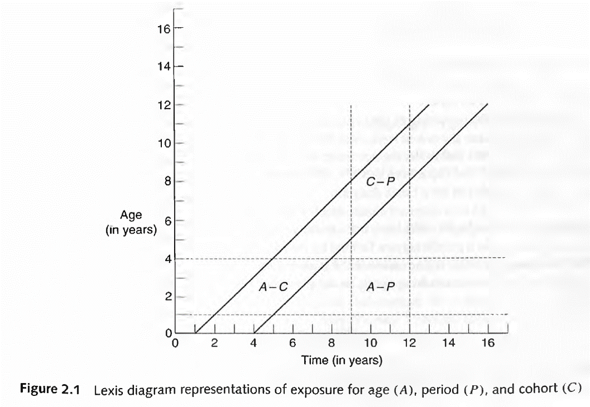
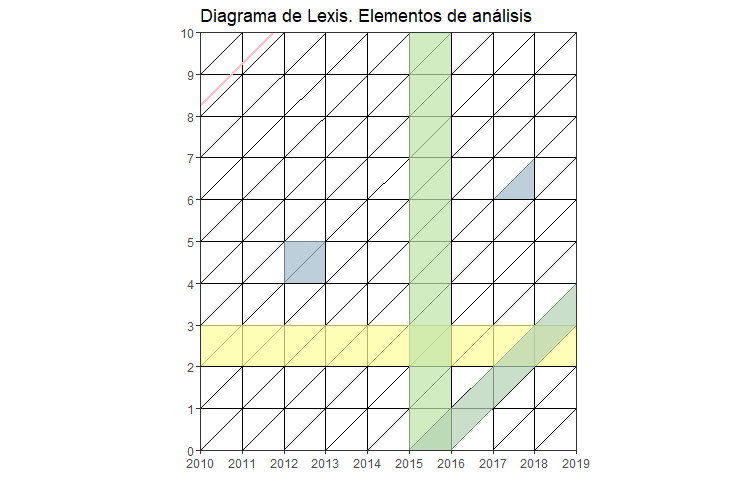

# ggplot

```{r include=FALSE}
knitr::opts_chunk$set(echo = TRUE, warning = F)
library(knitr)
library(fontawesome)
library(tidyverse)
Sys.setlocale("LC_ALL", "Spanish_Spain.UTF-8")
eder_personas <- read.csv("data/eder2019_personas.csv")

```


## Introducción

En esta sección vamos a explorar la utilidad de R para la visualización de contenido demográfico. En [Riffe y otros (2021)](https://www.demographic-research.org/volumes/vol44/36/default.htm) se publicó una colección de artículos sobre ejemplos de "buena" visualización en este tema. Allí reseña un poco de la historia (ver los gráficos de Perozzo `r fa("face-surprise")`) y se concluye con algunas recomendaciones a la hora de pensar cómo mostrar lo que queremos comunicar. Es interesante la distinción entre gráfico **exploratorio** y gráfico **explicativo**.

## ggplot

El paquete [ggplot](https://ggplot2.tidyverse.org/) del entorno *tidyverse* tiene sus fundamentos en la gramática de gráficos ([Wilkinson, 2005](https://link.springer.com/book/10.1007/0-387-28695-0)), entender que todo plot es una composición de elementos, más allá de su especificidad (dispersión de putnos, línea, torta, etc.). La idea es "generalizar" su construcción tal que un paquete no sea una colección de *casos especiales*, sino una forma particular de combinar elementos (capas). Ya lleva 10 años!

Todo gráfico esta compuesto, jearárquicamente, por:

  - **Datos**: lo que contiene (en un formato determinado) aquello que queremos visualizar. Se utilza el argumento `data`.
    - *Capas*
      - **Estética** determinada: ¿quién es "x"?, ¿quién es "y"?, tamaño (`size`), color (`color`) y forma (`shape`), entre otros. Para esto se utiliza la función `aes` (de *aestethics* en ingles), y permite *mapear* las columnas de la data a cada argumento.
      - Expresión **geométrica** de los datos. Las más comunes son:
        - Puntos (`geom_point`)  
        - Líneas (`geom_line`)  
        - Barras (`geom_bar`) 
    - *Transformación* estadística (ajustar una regresión lineal, segmentar por percentiles, frecuencia de barra, etc.) 
  - **Sistema de coordenas** y **Escalas**: las medidas relativas con las cuales interpretar los datos y su transformación visual. Personalización de ejes y leyenda, cambiar a escala logarítmica, asignar una escala de colores, etc.

```{r, include=F}
getwd()

```

Vamos a ver la distribución por edad de la EDER con **ggplot**. Para eso, primero vamos a calcular cuántas personas hay por edad. Recordemos que hay un código 9999 para valores desconocidos de edad

```{r, message=F, warning=FALSE}
eder_dist <- eder_personas %>% 
  filter(p3b <= 103)|> 
  group_by(p3b) |> 
  summarise(n = n())

# genero un primer gráfico con los tres elementos básicos:
ggplot(data = eder_dist,                 # data
       aes(x = p3b, y = n)) +    # estética
       geom_line()                    # geometría
```

Lo bueno de `%>%` es que puedo verbalizar también aquí!
```{r, eval = F}
eder_dist |> 
  ggplot(aes(x = p3b, y = n)) +    # estética
  geom_line() 
```


::: {.take_note_box  .take_note data-latex="{take_note}"}
`ggplot` utiliza `+` en vez de ` %>% `. No es algo de lo que esté orgulloso su creador, pero tiene sus [razones](https://community.rstudio.com/t/why-cant-ggplot2-use/4372).
:::


Podemos separar mujeres y varones, distinguiéndolas por color (*estética*). Y vamos a sacar a la gente sin información de sexo.

```{r, message=F, warning=FALSE}
eder_dist_s <- eder_personas %>% 
  filter(p3b <= 103,
         p2 %in% 1:2)|>
  group_by(p2, p3b) |> # Agrupo también por sexo 
  summarise(n = n())

# genero un primer gráfico con los tres elementos básicos:
eder_dist_s |> 
  ggplot(aes(x = p3b, y = n, color = factor(p2))) +    # estética
  geom_line() 
```

Podemos adicionar otra capa geométrica de puntos distinguiendo por *forma* (atributo estético adicional). Ya estamos en 4 dimensiones.

```{r}
g_eder_sexo <- eder_dist_s |> 
  ggplot(aes(x = p3b, y = n, color = factor(p2))) +    # estética
  geom_line() +
  geom_point(aes(shape = factor(p2)))
```

Acabamos de crear un objeto: ¿de qué tipo es?. 

::: {.take_note_box  .take_note data-latex="{take_note}"}
Lo que se encuentra dentro de `ggplot()` vale para todas las capas, excepto se "pise". Por ejemplo, da el mismo plot las siguientes dos sentencias:
`data %>% ggplot(aes(x= EDAD, y = MUJER) + geom_line()`
que...
`data %>% ggplot() + geom_line(aes(x= EDAD, y = MUJER))`
:::

Agreguemos [un título, un subtítulo](https://ggplot2.tidyverse.org/reference/labs.html), modifiquemos el tamaño del punto, la posición y título de la leyenda, y  especifiquemos las marcas en el eje x:

```{r, message=F, warning=FALSE}
g_eder_sexo <- g_eder_sexo +  # partimos del objeto anterior
  labs(title = "Población por edad y sexo. EDER 2019",
       subtitle = "CABA",
       caption = "Fuente: IDECBA",
       x = "Edad", y = "n") +
  theme(legend.position = "bottom", 
        legend.direction = "horizontal",
        legend.title = element_blank()) +
  scale_x_continuous(breaks = seq(0,100,10)) # ups!
g_eder_sexo
```

Podemos definir una paleta de colores, cambiar la [temática](https://ggplot2.tidyverse.org/reference/theme.html) de fondo por una más simple y suavizar las series con algún modelo. Adicionalmente mediante [ggsave](https://ggplot2.tidyverse.org/reference/ggsave.html) podemos guardar el objeto como imágen en la extensión que se desee.

```{r, warning=FALSE}
mi_paleta <- c("#000000", "#E69F00", "#56B4E9") # sistema Hexadecimal de colores

g_eder_sexo <- g_eder_sexo +
  scale_colour_manual(values = mi_paleta) +
  theme_bw() + 
  geom_smooth(method = 'loess', span=.5) # podés jugar con span (0,1)

ggsave(filename = "g_eder_sexo.pdf", plot = g_eder_sexo, dpi = 150)

g_eder_sexo
```

Podés encontrar [más colores y paletas prediseñadas](http://www.cookbook-r.com/Graphs/Colors_(ggplot2)/), temáticas [predefinidas](https://ggplot2.tidyverse.org/reference/ggtheme.html) o incluidas en paquetes como [ggthemes](https://yutannihilation.github.io/allYourFigureAreBelongToUs/ggthemes/), y formas de suavizar una serie continua (aquí utilizamos `loess`, por defecto, pero puede ser `lm`, de linear model).  

También podemos mostrar, por ejemplo, la distribución por máximo nivel educativo (una variable de tipo *factor*). Una buena idea: siempre tratar con **tidy** data! 

```{r, results='hold',out.width="100%",echo=FALSE, fig.cap="https://github.com/allisonhorst/stats-illustrations"}
include_graphics("figs/tidydata.jpg")
```

Lo que vamos a hacer ahora, y solo a fines de entender cómo se puede armar, es llegar a un data frame donde tengamos el sexo en las columnas, y el nivel educativo en las filas.

Para esto utlizaremos las funciones `pivot` (antiguamaente llamadas *gather* y *spread*, por si lo ves en la web). Leamos la hoja de ayuda (*cheat sheet*) de [tidyr](https://tidyr.tidyverse.org/) juntos, otro paquete del entorno `tidyverse`. 


```{r, message=F, warning=FALSE}
eder_ned_sexo <- eder_personas %>% 
  filter(p2 %in% 1:2, # Elimino los que no tienen asignado el sexo y el nivel educativo
         e_nivel != 9) |> 
  mutate(sexo = case_when(p2 == 1 ~ "Varon", # Recodifico
                          p2 == 2 ~ "Mujer"),
         e_nivel_desc = case_when(e_nivel == 0 ~ "No corresponde/escuelas especiales",
                                  e_nivel == 1 ~ "Inicial",
                                  e_nivel == 2 ~ "Primario incompleto",
                                  e_nivel == 3 ~ "Primario completo",
                                  e_nivel == 4 ~ "Secundario incompleto",
                                  e_nivel == 5 ~ "Secundario completo",
                                  e_nivel == 6 ~ "Superior / Universitario incompleto",
                                  e_nivel == 7 ~ "Superior / Universitario completo y mas",
                                  e_nivel == 8 ~ "Sin instruccion")) |> 
  select(sexo, e_nivel_desc) |> 
  group_by(sexo, e_nivel_desc) |> 
  summarise(n = n()) |> 
  pivot_wider(names_from = sexo, values_from = n)%>% 
  mutate(e_nivel_desc = factor(e_nivel_desc,
                               levels = c("No corresponde/escuelas especiales",
                                          "Inicial",
                                          "Primario incompleto",
                                          "Primario completo",
                                          "Secundario incompleto",
                                          "Secundario completo",
                                          "Superior / Universitario incompleto",
                                          "Superior / Universitario completo y mas",
                                          "Sin instruccion"))) |> 
  arrange(e_nivel_desc)

```

Es el momento de pasar a una geometría de barras. Al momento de trabajar con *barras*, la estética `fill` equivale al atributo `color` de líneas o puntos. Podemos incluir el condicional de signo dentro de la definición de ejes (o de manera previa mediante `mutate`, como prefieras):

```{r, message=F, warning=FALSE}

dist_ned_muj <- eder_ned_sexo |> 
  ggplot(aes(x = e_nivel_desc, y = Mujer, fill = e_nivel_desc))+
  geom_col()

dist_ned_muj
```

Ups! Habría que darlo vuelta (*flip*) para que se vea mejor. Podemos hacerle unos cambios adicionales de paso: incluir titulo, subtítulo y fuente, cambiar las etiquetas de ambos ejes, incluir un *tema* distinto y cambiar el color de las barras.      

```{r, message=F}
dist_ned_muj <- dist_ned_muj +
            coord_flip() +
            scale_y_continuous(labels = abs) +
            labs(y = "n", 
                 x = "Nivel educativo",
                 title = "Mujeres por nivel educativo",
                 subtitle = "EDER CABA",
                 caption = "Fuente: en base a IDECBA") +
            theme_bw()
dist_ned_muj  
```
        
Probablemente querramos varones y mujeres. Volvamos a poner el sexo como una variable, esta vez con `pivot_longer`
```{r, message=F, warning=FALSE}
eder_ned_sexo_long <- eder_ned_sexo |> 
  pivot_longer(cols = c("Mujer", "Varon"), names_to = "Sexo",values_to ="n")

eder_ned_sexo_long
```


Y si quisiéramos ver el mismo gráfico que antes, pero separado por sexo, podemos usar las opciones de [faceting](https://ggplot2.tidyverse.org/reference/facet_grid.html). :

```{r, message=F, warning=FALSE}
g_ned_sexo <- eder_ned_sexo_long %>% 
  ggplot(aes(x = e_nivel_desc, y = n, fill = e_nivel_desc))+
  geom_col()+
  coord_flip() +
  scale_y_continuous(labels = abs) +
  labs(y = "n", 
  x = "Nivel educativo",
  title = "Poblacion por sexo y nivel educativo",
  subtitle = "EDER CABA",
  caption = "Fuente: en base a IDECBA") +
  theme_dark() +
  facet_grid(rows = vars(Sexo)) # o cols?
g_ned_sexo
```

¿Podríamos mostrar las distribuciones al interior del total? ¡Claro!

```{r, message=F, warning=FALSE}
g_ned_sexo_stack <- eder_ned_sexo_long %>% 
  ggplot(aes(x = Sexo, y = n, fill = e_nivel_desc))+
  geom_col(stat = "identity")+ # con este parámetro, se apilan
  scale_y_continuous(labels = abs) +
  labs(y = "n", 
  x = "Nivel educativo",
  title = "Poblacion por sexo y nivel educativo",
  subtitle = "EDER CABA",
  caption = "Fuente: en base a IDECBA") +
  theme_bw()   
g_ned_sexo_stack
```

Finalmente, cuando necesites guardar el gráfico, por ejemplo como pdf:

```{r, eval = F}
ggsave(plot = "g_ned_sexo_stack.pdf", filename = g_ned_sexo_stack)
```


Quizás si fuera un gráfico interactivo... Un bonus track utilzando [plotly](https://plot.ly/ggplot2/):

```{r, message=F, warning=FALSE}
#install.packages("plotly")
library(plotly)
g_ned_sexo_plotly <- ggplotly(g_ned_sexo_stack + aes(text = n), tooltip= "text") 
g_ned_sexo_plotly
```


## Lexis

Gráfico útil para representar la dinámica poblacional de *ingreso* y *permanencia* en un estadío demográfico según edad, tiempo calendario (o período) y año de nacimiento (o cohorte). Su aplicación más común es en mortalidad, pero es generalizable a la relación exposición~evento con múltiples  [usos](https://apuntesdedemografia.com/curso-de-demografia/temario/tema-2-generalidades/el-diagrama-de-lexis/).  
{width=500px}

Los elementos principales de análisis son:

* Líneas de vida (45°)  
* Segmentos horizontales y verticales  
* Superficies  



Ejemplos de uso del diagrama utilizando R:

* Mortalidad por conflictos armados (replicable):

Fuente: Alburez et. al (2019)

* Sobremortalidad masculina en Inglaterra y Gales (1841-2013):

Fuente: Schöley & Willekens (2017)

Construyamos el diagrama básico del inicio. Para eso haremos uso del paquete [LexisPlotR](https://github.com/ottlngr/LexisPlotR) creado por Philipp Ottolinger (gracias Otto). Construyó un set de funciones basadas en *ggplot* que facilita la creación de diagramas haciéndolo un ejercicio intuitivo. 

```{r, message=F, warning=FALSE}
# install.packages("devtools")
# devtools::install_github("ottlngr/LexisPlotR") #¿Cómo no esta en CRAN?
library(LexisPlotR)
library(tidyverse)

# creamos el objeto "mylexis", definiendo el rango de sus ejes: los primeros 10 años de vida durante 2010-2019. Aquí podemos especificar un "delta" si es que nos interesan los grupos quinquenales.
mylexis <- lexis_grid(year_start = 2010, year_end = 2019, age_start = 0, age_end = 10)

# pintamos la edad 2
mylexis <- lexis_age(lg = mylexis, age = 2)

# pintamos el año 2015, de gris en este caso.
mylexis <- lexis_year(lg = mylexis, year = 2015, fill = "grey")

# Ahora la cohorte 2015
mylexis <- lexis_cohort(lg = mylexis, cohort = 2015)

# Una línea de vida, ¡elemento fundamental del diagrama!
mylexis <- lexis_lifeline(lg = mylexis, birth = "2001-09-23", lwd = 1, colour = "pink")

# Al ser un objeto ggplot, podemos incorporarle atributos, como el título
mylexis <- mylexis + labs(x="Año", y = "Edad",title = "Diagrama de Lexis. Elementos de análisis")

# Para crear polígonos, el autor se basa en la geometría "geom_polygon". Creamos un cuadrado. El orden de los datos es importante. Además podemos crear muchos polígonos al mismo tiempo señalando los grupos.
square <- data.frame(group = c(1, 1, 1, 1),
                       x = c("2012-01-01", "2012-01-01", "2013-01-01", "2013-01-01"),
                       y = c(4,             5,            5,            4))
mylexis <- lexis_polygon(lg = mylexis, x = square$x, y = square$y, group = square$group)

# Creamos el triángulo. ¿A qué refiere?
triangle <- data.frame(group = c(1, 1, 1),
                       x = c("2017-01-01", "2018-01-01", "2018-01-01"),
                       y = c(6, 6, 7))
mylexis <- lexis_polygon(lg = mylexis, x = triangle$x, y = triangle$y, group = triangle$group)

# Imprimimos!
mylexis
```

Adicionalmente, si trabajamos con población donde la exposición puede ser truncada (por derecha o izquierda), podemos graficar líneas de vida que respeten ese comportamiento. Tambien podemos señalar con una cruz la ocurrencia del evento de salida que se estudia.

```{r, message=F, warning=FALSE}
# ingresa al estudio sobre deserción escolar en el año 2012 un niño/a nacido en el año 2005, abandonando el colegio a los 9 años de edad:
mylexis <- lexis_lifeline(lg = mylexis, 
                          birth = "2005-09-23", 
                          entry = "2012-06-11", exit = "2015-02-27", lineends = T,
                          colour = "red")
mylexis
```

Pero atrás de esto esta `ggplot`!

```{r, message=F, warning=FALSE}
ggplot() +
  geom_segment(aes(x = 2011, y = 5, xend = 2015, yend = 9), color = "red", size=1)+ # debería ir al final
  geom_point(aes(x=2015, y=9),shape=4,size=2,col=4)+
  coord_equal() +
  scale_x_continuous(breaks=2010:2020, expand = c(0,0)) +
  scale_y_continuous(breaks=0:10, expand = c(0,0)) +
  geom_vline(xintercept = 2010:2020, color="grey", size=.15, alpha = 0.8) +
  geom_hline(yintercept = 0:10, color="grey", size=.15, alpha = 0.8) +
  geom_abline(intercept = seq(-2020, -2000, by=1), slope = 1, color="grey", size=.15, alpha = 0.8)+
  labs(x="Año", y="Edad",title = "Dieagrama de Lexis c/ ggplot")+
  theme_minimal()+
  theme(panel.grid.major = element_line(colour = NA),
        panel.grid.minor = element_line(colour = NA),
        plot.background = element_rect(fill = "white", 
                                       colour = "transparent"))
```

Para incluir triángulos y cuadriláteros se utiliza [geom_polygon](https://ggplot2.tidyverse.org/reference/geom_polygon.html). Para dar superficie, de manera similar al gráfico Scholey & Willekens (2017), se utiliza [geom_tile](https://ggplot2.tidyverse.org/reference/geom_tile.html). Para esto último un gran tutorial de [Tim Riffe](https://timriffe.github.io/DemoTutorials/LexisSurface).


## Estudio de cohorte: un ejemplo

Construyamos una tabla de cohorte a partir de un grupo de estudiantes que iniciaron con 3 años de edad (cumplida) su trayectoria educativa el 3/3/2000, y donde la *salida* es dejar el estudio (sea cual sea el nivel alcanzado) por **primera vez** antes de retomar o abandonar definitivamente (¿en este contexto qué sería $\omega$?). Simulemos el comportamiento de 1000 chicas/os con distribución *uniforme* de la edad y distribución *gamma* del tiempo de permanencia:

```{r, message=F, warning=FALSE}
set.seed(100) # qué es esto?
clase <- data.frame(edad_inicio = runif(n = 1000, min = 3, max = 4),
                    tiempo_exp = rgamma(n = 1000, shape = 40, rate = 2)) %>% 
          mutate(edad_salida = edad_inicio + tiempo_exp)
```

¿Cómo luce?
```{r}
ggplot(clase, aes(x=edad_salida)) + 
  geom_histogram(fill=2, alpha=.5) +
  labs(x = "Edad de salida", y = "Densidad", 
       title = "1000 casos simulados de edad de primer salida educativa")
```

Construyamos el diagrama de Lexis de esta cohorte utilizando `LexisPlotR`:

```{r, message=F, warning=FALSE}
# una forma de moverse en el tiempo: a una fecha restarle cantidad de días
clase$nacimiento  <- as.Date("2000-03-03") - clase$edad_inicio * 365.25
clase$salida      <- clase$nacimiento + clase$tiempo_exp * 365.25

# creo Lexis
mylexis     <- lexis_grid(year_start = 2000, year_end = 2025, age_start = 3, age_end = 30)
mylexis     <- lexis_lifeline(lg = mylexis, 
                          birth = clase$nacimiento, 
                          entry = "2000-03-03", 
                          exit = clase$salida, lineends = T,
                          colour = 4, alpha = 1/3) + 
  theme(axis.text.x = element_text(angle = 90, vjust = 0.5, hjust=1))
mylexis
```

¿Por qué las líneas no empiezan justo en 2000? Estimemos algunos parámetros básicos:

```{r, results='hold'}
# la edad media de salida
mean(clase$edad_salida)

# la probablidad de "sobrevivir" a la edad 18
clase %>% filter(edad_salida >= 18) %>% summarise(n()/nrow(clase)) 

# probablidad de abandonar en los 20 años cumplidos 
clase %>% filter(edad_salida >= 20 & edad_salida < 21) %>% summarise(n()/nrow(clase))
```

### Actividad

a) Crear un diagrama de Lexis e incluir en rojo las líneas de vida de las 3 personas más jóvenes que conozcas.

```{r, eval = F, include = F}
mylexis <- lexis_grid(year_start = 2021, year_end = 2023, age_start = 0, age_end = 5)
lexis_lifeline(lg = mylexis, birth = c("2021-10-23", "2022-01-15", "2022-09-19"), lwd = 1, colour = "red")
```

a) Considerando el ejercicio de permanencia escolar:
    - Calcula la probabilidad de "salir" luego de los 30 años?
```{r, eval = F, include = F}
clase %>% filter(edad_salida >= 30) %>% summarise(n()/nrow(clase))
```
    - Cambia la semilla del ejercicio previo (`set.seed()`) por cualquier entero que desees y repite el ejercicio. ¿Hay diferencias? ¿Por qué?


## Reproduciendo

El covid19 puso en primera plana el análisis demográfico, especialmente en el impacto que tuvo en $e_0$ ¿No te parece genial la figura 1 del paper [Quantifying impacts of the COVID-19 pandemic through life-expectancy losses: a population-level study of 29 countries](https://academic.oup.com/ije/advance-article/doi/10.1093/ije/dyab207/6375510) de Aburto y Otros (2021)? Podemos recrearlo gracias a que los autores lo permiten [aquí](https://github.com/OxfordDemSci/ex2020/blob/master/src/08-plots.R), haciendo su paper reproducible. De paso vamos viendo funciones nuevas. Iremos comentando los pasos:

```{r}

# necesitamos algunas librerías que no tenemos aún. Si no las tenés debes instalarlas primero
#install.packages("hrbrthemes")
library(hrbrthemes)

# cargar la data

df_ex_ci <- readRDS("Data/df_ex_ci.rds")
head(df_ex_ci)

# crear el gráfico
fig_1 <- df_ex_ci %>%
  # primero factorizar según el número actual de la variable
  mutate(name = name %>% fct_reorder(rank_e0f19)) %>%
  # me interesa ciertas edades
  filter(age %in% c(0, 60)) %>%
  # si hay alguna NA sacar la fila
  drop_na(name) %>%
  # una forma de seleccionar
  transmute(name, sex, age,ex_2015, ex_2019, ex_2020 = ex) %>%
  # hete aquí un pivot...
  pivot_longer(cols = ex_2015:ex_2020,
               names_to = "year", values_to = "ex", names_prefix = "ex_") %>%
  mutate(age = age %>% as_factor()) %>% 
  # ggplot
  ggplot()+
  # un color por sexo, una forma por año
  geom_point(aes(x = ex, y = name, color = sex, shape = year))+
  # separar un poco con líneas grises
  geom_hline(yintercept = seq(2, 28, 2), size = 5, color = "#eaeaea")+
  # personalizar qué formas, tamaños y colores usar
  scale_shape_manual(values = c(124, 43, 16))+
  scale_size_manual(values = c(4, 4, 1.5))+
  scale_color_manual(values = c("#B5223BFF", "#64B6EEFF"))+
  # donde colocar los nombres de los ejes
  scale_y_discrete(position = "right")+
  scale_x_continuous(position = "top")+
  # facet por edad, sin respetar escala
  facet_grid(~age, scales = "free_x")+
  # sin leyenda, líneas horizonatales y demases
  theme(
    legend.position = "none",
    panel.grid.major.y = element_blank(),
    panel.grid.minor.y = element_blank(),
    strip.text = element_blank(),
    panel.spacing.x = unit(2, "lines"),
    axis.text.y = element_text(face = 2))+
  # etiquetas de ejes
  labs(x = "Life expectancy, years",y = NULL)

# guardar
ggsave(fig_1, filename = "fig-1.pdf",
       width = 6, height = 4.5, device = cairo_pdf)
```
Las etiquetas en referencia a la edad y la formas de los puntos las realizaron posteriormente con [annotate](https://ggplot2.tidyverse.org/reference/annotate.html), una función que permite incluir (encima) texto u otras figuras geométricas en el plano.

## Otras visualizaciones

Samuel Preston (1975) encontró una relación matemática (al menos) a nivel de país entre la esperanza de vida al nacer y el producto per cápita. Veamos que ocurre específicamente en el Continente Americano utilizando el paquete de datos `gapminder`.

```{r}
library(gapminder)

p <- ggplot(filter(gapminder, continent == "Americas"),
            aes(x = gdpPercap, y = lifeExp))
p + geom_point() # dispersión
p + geom_point(aes(color = country), alpha = (1/3), size = 3, show.legend = F) 
p1 <- p + geom_point(aes(color = country, size = pop), alpha = 1/3) # fijate el lugar de size 
p1 <- p1 + geom_smooth(lwd = 1, lty = 2, color = 2, se = FALSE)
p1
p + geom_point(alpha = 1/3, size = 3) + facet_wrap(~ country) +
    geom_smooth(lwd = 1.5, se = FALSE) +
    theme_void()

```

¿Componer gráficos en una sola hoja? (tomado de [Jenny Bryan](https://stat545.com/))
```{r}
#install.packages("gridExtra")
library(gridExtra)
p2 <- ggplot(filter(gapminder, year==1952 & continent!="Oceania"), aes(x = lifeExp, color = continent))       + geom_density()
p3 <- ggplot(filter(gapminder, year==2007 & continent!="Oceania"), aes(x = lifeExp, color = continent))       + geom_density()
grid.arrange(p2, p3, nrow = 2, heights = c(0.5, 0.5))
```

¿Qué problemas encuentras en este arreglo?

## Material adicional (y no tanto)

* Sí, hay un [libro](https://ggplot2-book.org/index.html).

* Estas notas fueron hechas siguiendo principalmente [The Hitchhiker's Guide to Ggplot2](https://leanpub.com/hitchhikers_ggplot2) y el curso de [Jenny Bryan](https://stat545.com/).  
* [Hoja de Ayuda](https://github.com/rstudio/cheatsheets/blob/main/data-visualization-2.1.pdf).  

* Hulíková Tesárková & Kurtinová. Application of “Lexis” Diagram: Contemporary Approach to Demographic Visualization and Selected Examples of Software Applications.

* Rau, R., Bohk-Ewald, C., Muszyńska, M. M., & Vaupel, J. W. (2018). Visualizing Mortality Dynamics in the Lexis Diagram. Springer. doi: 10.1007/978-3-319-64820-0
