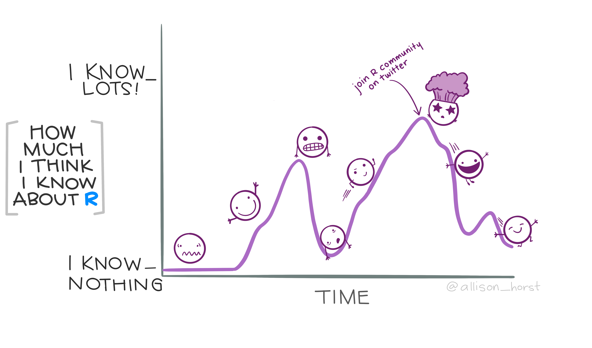

# TP

```{r include=FALSE}
knitr::opts_chunk$set(echo = TRUE, warning = F)
library(knitr)
library(fontawesome)
library(tidyverse)
Sys.setlocale("LC_ALL", "Spanish_Spain.UTF-8")
```

## Hemos llegado:
  


## Consigna

Realizar un reporte sobre las características de la base de datos y la población encuestada en la EDER. Específicamente, se solicita:

* Crear un *Script* que procese la información necesaria e incluya comentarios que vayan explicando el paso a paso donde se obtiene la información que irá en el reporte. Se puede entregar script comentado solo, o script + documento de texto.

Contenidos **mínimos** del cuerpo del script:

Primero debés leer los datos de la EDER directo desde R (ya lo hemos hecho) e incluir todos los paquetes que vas a usar. 

Luego agregar:

- Un párrafo inicial donde se explicite el objetivo del reporte (como comentario en el script). 
    
- Mostrar características básicas de la base de datos de la EDER.

- Comentar al menos 2 características de la población total encuestada y 2 de la población que realizó la encuesta retrospectiva. Acá podés elegir qué mostrar, pero al menos una de las características tiene que estar segmentada por grupos (puede ser sexo, grupo de edad, nivel educativo).
    
- Presentar resultados con etiquetas, no con códigos.
    
- Calcular el índice de masculinidad por edad de la población de 0 a 80 años y realizar un gráfico de línea (pista: quizás te sirve tener sexo en dos columnas separadas).
    
- En un párrafo final describir brevemente qué te llamó la atención de lo observado.
    
**¡IMPORTANTE!** 

Si bien puede haber una devolución conceptual, no serán evaluadas las conclusiones. El resultado de la evaluación será tarde o temprano "Aprobado"`r fa("face-smile-wink")``.

**Fecha de entrega: 4/5/2025**

¡Buen Viaje!



