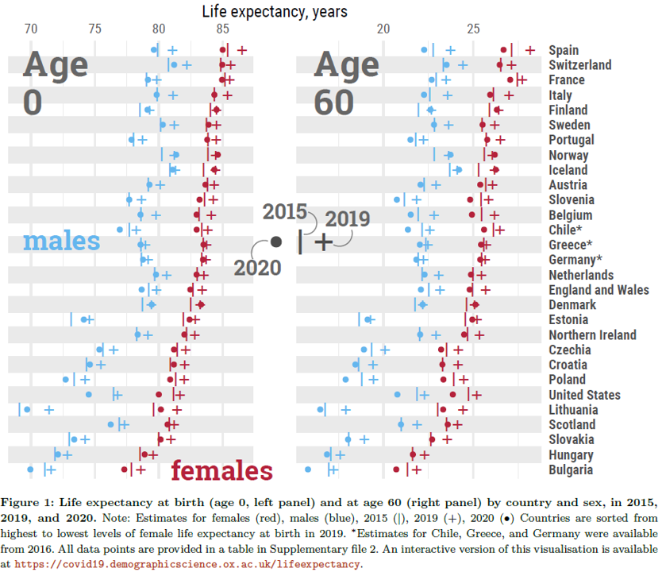
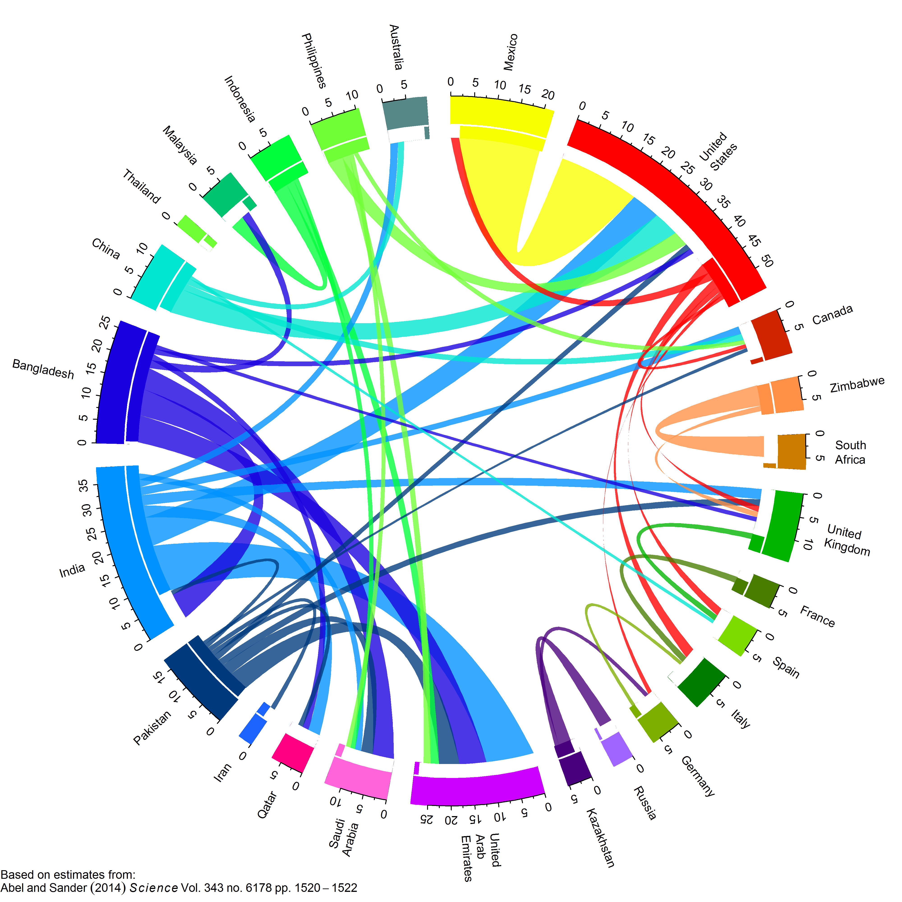

<style>
p.caption {
  font-size: 0.6em;
}
</style>

```{r setup, include=FALSE}
knitr::opts_chunk$set(echo = FALSE, warning = F)
options(htmltools.dir.version = FALSE)
library(calendR)
library(patchwork)
library(knitr)
library(fontawesome)
```

# Este Taller

## ¡Bienvenidos!

--

## Objetivo

  - Dar tus primeros pasos en R
  - Que puedas comenzar tu próximo proyecto de trabajo demográfico en R 

--

Programa el que...

--

```{r, out.width="50%",fig.align='center',fig.cap="https://ivandigital.net/portfolio/carrera-sucia-2019-diciembre/"}
include_graphics("https://ivandigital.net/wp-content/uploads/2021/02/Ivan-Digital-Carrera-Sucia-DIC-2019-0008.jpg")
```

---

# Unidades

.pull-left[
1 - **Introducción y objetos principales**
  - Proyectos + R base + operaciones
  - Unx demógrafx que sabe R

2 - **Lectura y manipulación de datos**
  - `dplyr`. Mundo [tidyverse](https://www.tidyverse.org/)
  - Resumen y transformación de datos
  - Una encuesta en R

3 - **Visualización**
  - `ggplot`
  - Pirámides + Lexis
]

---

# PrepaRándonos

## Estructura

- Clases
  - ~2,5 horas de recorrido temático, programando a la par
  - ~30 minutos de resolución de ejercicios
- Trabajo práctico luego de las 3 clases

## Set up inicial    

- `r fa("r-project")` + `r fa("registered")`  instalados  
- Conexión a internet (clases virtuales)  
- Materiales: en general todo en `r fa("github")` [Github](https://github.com/fbathory/TallerDemoR). Eventualmente algo de datos pesados en la nube `r fa("google-drive")`.
- `r fa("question")`: para dudas/intercambios utilizaremos el Aula Virtual

---

# `r fa("r-project")` y la Demografía

- [Reproducibilidad](<https://en.wikipedia.org/wiki/Replication_crisis>)
    - Hombros de gigantes  
    - Misma data + código = mismo paper.
    - [Demographic Research](https://www.demographic-research.org/volumes/replicable_articles.htm)
    
```{r, out.width = "80%", fig.align='center', fig.cap="https://www.monicaalexander.com/posts/2019-10-20-reproducibility/"}
include_graphics("figs/flow1.png")
```

---

# `r fa("r-project")` y la Demografía

- Paquetes:
  - [DemoTools](https://timriffe.github.io/DemoTools/)
  - [HMDHFDplus](https://cran.r-project.org/web/packages/HMDHFDplus/HMDHFDplus.pdf)
  - [MortalityLaws](https://cran.r-project.org/web/packages/MortalityLaws/MortalityLaws.pdf)
  - [DemoKin](https://cran.r-project.org/web/packages/DemoKin/index.html)
  - Muchos más...

- Difusión/comunicación de contenido:  
  - [Exceso de Mortalidad](https://mpidr.shinyapps.io/stmortality/)  
  - [Indicadores](https://www.indec.gob.ar/indec/web/Institucional-Indec-IndicadoresDemograficos)
  - [Tablero de indicadores de las personas mayores](https://www.indec.gob.ar/indec/web/Nivel4-Tema-2-21-130)
  - [Sistema Integrado de Indicadores Sociales](http://shiny.indec.gob.ar/sies)
  - [Talleres/Seminarios/presentaciones](https://github.com/ubasellini/IDEM117-AdvancesMortalityForecasting)

---

# Mortalidad

```{r, out.width = "70%", fig.cap="Aburto & otros, 2021", fig.align='center'}

```
---

# Fecundidad

```{r, out.width = "80%", fig.cap="World Population Prospects 2019 Rev.", fig.align='center'}
include_graphics("figs/Argentina_forecast_tfr.png")
```

---

# Migración

```{r, out.width = "65%", fig.align='center'}

```

---
class: inverse, center, middle

# ¡Comencemos!

